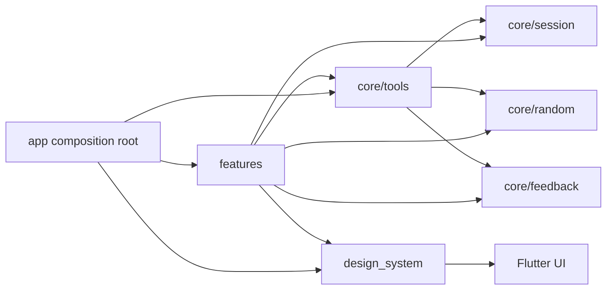
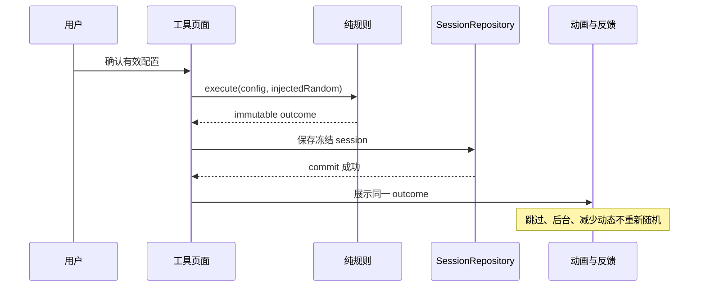

# Pocketools 架构与扩展指南

- **状态**：v0.1.1+2 实现契约，随可执行架构测试维护。
- **目标平台**：Android、Web/PWA。
- **更新时间**：2026-08-24。
- **适用对象**：新增工具、修改共享 UI、接入存储/分享/平台能力的开发者与评审者。

本文档描述当前代码必须遵守的扩展边界。产品规则以『需求文档』为准，交互数值以『交互设计』和 design tokens 为准；本文件负责说明代码放在哪里、可以依赖什么、怎样证明没有复制公共管线。

## 架构目标

- 新增工具时，正常改动只包含工具模块、模块测试、内容/许可记录和 composition root 中的一处注册声明。
- 应用 shell、导航、历史、分享、随机核心和会话状态不根据工具 ID 写分支。
- 六个玩法工具、图鉴模块和未来 fake 模块共享按钮、表单、状态视图、结果容器、导航和平台反馈接口。
- 随机结果先生成并冻结；动画、触觉、分享和历史只消费同一不可变结果。
- Android 与 Web 共享纯 Dart 规则和结构化结果；平台差异只进入适配器。
- 修改全局按钮的尺寸、圆角、状态或动效时，只改 design token 或 `AppButton`，不逐页修改。

## 代码分层

```text
lib/
  app/                  composition root、应用 shell、平台适配器
  core/
    random/             安全随机抽象与可注入测试序列
    session/            不可变会话 envelope 与仓库接口
    presets/            系统／用户预设模型、能力聚合与离线快照
    feedback/           平台无关反馈接口
    tools/              ToolModule、registry、session/history/share adapter
  design_system/        tokens、主题和共享组件
  features/
    <tool>/
      domain/           配置、结果、纯规则
      presentation/     codec、module、page、专属 visual primitive
```

依赖方向如下：



约束：

- `domain` 不依赖页面、应用 shell、网络、系统时间或平台 API。
- 工具页面不实例化安全随机源；只使用 `ToolModuleContext.randomSource`。
- 工具页面不调用 `HapticFeedback`、JS vibration 或平台 channel；只使用 `ToolModuleContext.feedbackService`。
- `features` 不导入 `lib/app/`。composition root 可以依赖 feature，feature 不反向依赖 composition root。
- 动画组件接收不可变 outcome 或已解码会话，不能持有随机源。
- 内容文案与规则计算分离；调整解释不改变牌、爻、骰、硬币或扑克结果。

### 随机实体交互协议

牌堆、骰子、硬币和六爻铜钱虽然规则不同，但共享同一条可扩展的实体交互边界：

| 层 | 共享职责 | 工具差异 |
| :--- | :--- | :--- |
| `AppEntityStateView` | 唯一实体舞台，承载实体、动画、结果摘要、错误和恢复 | 舞台内的实体布局与结果摘要 |
| `AppGenerationStateView` | 仅作为 `AppEntityStateView` 内的状态胶囊，展示统一阶段、文案和读屏状态 | `ready`、`pressed`、`generating`、`revealing`、`completed`、`reduced` |
| `AppPhysicalAction` | D20/DND、硬币和六爻共用的 48 px 命中区、鼠标/触摸/键盘激活、语义、焦点与按压反馈 | 实体 child、`primaryAction` 和语义文案 |
| `AppPhysicalDeck` | 塔罗和扑克共用的牌堆命中包装；每次激活只追加一张牌 | 牌堆 child、单张抽牌动作和牌类语义 |
| `AppDeckResultFlow` | 牌堆固定在前，已抽牌按顺序追加并响应式换行 | 牌堆和有序牌面列表 |
| 专属 primitive | 真实感外观、实体运动和冻结结果的视觉表达 | 塔罗牌面、扑克牌面、D20、硬币、三枚铜钱/爻线 |
| 领域结果 | 每次动作生成并冻结、无放回/规则计算、历史与分享输入 | 牌、骰点、正反面、爻值与解释 |

因此 D20/DND 的每枚骰子、硬币实体以及六爻的三枚铜钱都通过 `AppPhysicalAction` 成为同一主动作的命中入口；塔罗和扑克通过 `AppPhysicalDeck` + `AppDeckResultFlow` 复用牌堆与有序结果流。卦象本身只负责信息展示，不复制随机路径。牌类的 `n` 是本轮目标数量，不是一次性批量动作；每次点击只追加一张，部分会话由既有 codec 保存并恢复。新增实体型玩法应先复用该协议，再补充专属 primitive，而不是复制一套页面状态卡或按钮。

## 工具模块协议

每个工具实现同一个公开入口：

```dart
abstract interface class ToolModule {
  ToolDescriptor get descriptor;
  ToolSessionCodec get sessionCodec;
  Widget buildConfig(BuildContext context, ToolModuleContext moduleContext);
}
```

`ToolDescriptor` 是工具发现、路由、名称、图标、语义色和可用状态的唯一来源。首页（已合并工具目录）遍历 `ToolRegistry.modules`，不得维护第二份工具清单。

`ToolSessionCodec` 负责在类型化领域对象与共享会话 envelope 之间转换。codec 必须：

- 使用稳定工具 ID、字段名和 schema；不把本地化展示文案作为主键。
- 编码前验证配置与结果，解码时拒绝未知类型、重复结果和不一致派生字段。
- 为已发布 schema 提供兼容读取，新增编码仍写当前完整字段。
- 牌类 codec 可读取目标 `n` 尚未完成的合法部分结果，并在同一会话中继续恢复；这不引入另一套会话协议。
- 生成不包含问题、备注、本地 ID、设备或分析字段的摘要。

### 预设能力协议

预设通过 `ToolPresetProvider` 作为可选能力注册到 `ToolRegistry`。提供者只负责三件事：声明稳定的系统预设、把结构化规则 map 解码为工具已有的输入模型、把输入模型编码为不含私人字段的规则 map。

- `ToolPreset` 明确区分 `PresetType.system` 与 `PresetType.user`，并同时记录 `PresetSource.bundled` 或 `PresetSource.local`、稳定 ID、工具 ID、显示名称、schema 版本和规则版本。
- 系统预设由模块代码提供，只读且不写入用户快照；复制系统预设会生成新的用户 ID，后续系统规则升级不会覆盖该用户记录。
- `ToolRegistry.systemPresets` 和 `ToolRegistry.launchRequestForPreset()` 聚合并应用能力；管理页只遍历 provider，不维护工具 ID `switch`。
- 预设应用统一生成 `ToolLaunchRequest`，继续进入各工具已有的配置输入模型；预设本身不执行随机、不创建第二套规则计算。
- 当前实现提供塔罗三组、D20 普通／优势／劣势和硬币常用次数系统预设。塔罗 provider 编码时始终清空 `intention`。
- `ToolRegistry` 构造时会 fail-fast 校验所有系统预设的类型、来源、工具 ID、元数据、全局 ID 唯一性和配置解码结果，并以不可变快照对外暴露。
- `PresetController.load()` 按当前 registry/provider 校验用户记录；未知 provider、无法解码的配置和与当前系统 ID 冲突的记录只进入隔离状态并告警，不改写 active snapshot。系统升级只影响冲突记录，其他合法用户副本继续可用。
- v0.1 用户副本在冻结复制时保存当时的规则配置；管理页只支持重命名和删除。工具页对本次草稿的调整不会回写预设，未来应通过一个共享 save capability 实现，不能在三个工具页面分别复制保存逻辑。

模块默认自动获得 `ToolSessionAdapter` 提供的会话创建、历史摘要和文本分享。只有分享结构确有工具语义差异时才实现 `ToolSessionAdapterProvider`；不得复制整条历史或分享管线。

## 新工具接入流程

新增工具至少完成以下原子改动：

- 在 `lib/features/<tool>/domain/` 定义不可变配置、结果和纯规则执行器。
- 规则只通过注入的 `RandomSource` 取值，先完整校验再消耗随机值。
- 在 `presentation/` 实现 codec、`ToolModule`、配置/结果页面和必要的专属 visual primitive。
- 页面组合共享 `AppToolScaffold`、`AppButton`、`AppStepper`、`AppEntityStateView`（内部的 `AppGenerationStateView` 仅作状态胶囊）、共享 surface 与导航语义；D20/DND、硬币和六爻复用 `AppPhysicalAction`，塔罗和扑克复用 `AppPhysicalDeck` + `AppDeckResultFlow`。
- 在 `buildDefaultToolRegistry()` 增加一处注册声明；不修改首页（已合并工具目录）、历史页或分享页的工具 ID 分支。
- 增加固定随机向量、边界、codec、widget、恢复、分享脱敏和架构契约测试。
- 更新需求映射、内容来源与许可证据。

预期评审 diff 不应包含：

- 新建另一套按钮、导航、结果卡、历史格式或分享预览。
- 在应用 shell 中出现 `if (toolId == ...)` 或 `switch (toolId)`。
- 在动画 callback 中再次抽取随机值。
- 为了工具主题复制整页样式或硬编码颜色、圆角、间距和时长。
- 通过时间戳、普通伪随机或 UI 状态降级安全随机源。

## 随机与规则边界

`RandomSource.nextInt(maxExclusive)` 是工具规则的唯一随机原语。生产环境使用安全随机实现；测试注入固定序列。

一次生成按以下顺序执行：



硬约束：

- 配置非法、存储 commit 失败或安全随机源不可用时，不进入揭示动画。
- 动画中断、页面隐藏、路由离开和恢复只改变展示状态，不创建第二个结果。
- “再来一次”或“重新抽取”创建新 session，并通过 `parentSessionId` 关联旧 session。
- 规则版本和算法版本写入每个会话；旧会话不因新版本重新计算。

## 会话、历史与分享

`SessionRecord` 是跨工具 envelope。`input` 和 `outcome` 在构造时递归复制并冻结；不支持的可变对象和循环引用必须被拒绝。

共享消费者只能通过 registry 和 adapter 读取工具数据：

- `ToolRegistry.decode()`：恢复类型化输入与结果。
- `ToolRegistry.historySummary()`：生成工具无关历史行。
- `ToolRegistry.sharePayload()`：生成默认脱敏文本，或调用模块声明的受限 renderer。

历史和分享不得直接解析某个工具的私有 Map。这样新增工具只需注册 codec/adapter，就能进入公共消费者。

持久化适配器必须满足：

- Android 与 Web 保存同一 envelope 字段和版本语义。
- 写入是单会话原子提交；完成结果不会被后续备注或设置改写。
- 旧 schema 可迁移或隔离，失败不静默删除原始数据。
- 删除操作具有明确范围，不能把 `clean` 或构建缓存操作连接到用户历史。

预设持久化使用独立的 `pocketools.presets.snapshot.active.v1`／`pending.v1` allowlist，不复用 session 快照，也不在删除预设时触碰历史。快照包含顶层 storage schema、逐条 preset schema、严格字段集合和结构化配置；损坏记录隔离，平台存储不可用时切换到进程内存预设仓库，六个玩法工具仍可启动和生成结果，图鉴仍可离线浏览。

## 共享 UI 与主题

公共外观由三层控制：

- `app_tokens.dart`：尺寸、间距、圆角、动效和工具语义色。
- `app_theme.dart` 与 `AppToolTheme`：把 token 注入 Flutter 主题和当前工具语义。
- `design_system/components/`：实现可访问的公共组件状态。

工具可以提供：

- `ToolAccent` 对应的语义强调色。
- 塔罗牌、爻线、骰子、硬币、扑克牌等专属 visual primitive。
- 工具输入字段和结果摘要内容。

工具不能覆盖：

- 公共按钮的高度、圆角、loading、disabled、focus、按压反馈。
- 应用导航、页面 scaffold、会话状态、历史和分享行为。
- 减少动态、振动开关和平台能力检测的全局语义。

若某页面需要公共组件当前没有的能力，应先以可复用 API 扩展设计系统并给出跨工具测试；不得在单页复制一个“临时版本”。

## 动画与反馈

动画和触觉是结果反馈，不是随机来源。工具通过共享 token 使用按压、生成、揭示、完成和减少动态五态。

- 标准模式可以使用受限位移、旋转、缩放和分阶段触觉。
- 减少动态模式只使用立即展示或短淡入，同一 outcome 和无障碍目标不变。
- 关闭振动只移除触觉，不改变时序、结果或 session。
- Android 通过平台适配器提供克制 haptics；Web 只在能力、授权、页面可见和用户激活条件满足时尝试，否则 no-op。
- 页面隐藏或恢复时取消未执行动画和触觉，不补发、不重抽。

## 架构测试门禁

根目录命令是统一证据入口：

```bash
make check-format
make analyze
make test-unit
make test-widget
make test
make build-web
make build-android
make build-android-release
make verify
```

架构测试至少证明：

- fake 模块可通过 registry 被发现并获得会话、历史和分享能力。
- 默认首页只遍历 registry，不包含玩法工具或图鉴的硬编码 ID 路由分支。
- 工具 presentation 不直接导入平台振动、安全随机实现或应用 shell。
- 页面使用共享组件，不出现私有按钮样式和公共视觉 magic number。
- 修改一个 AppButton motion/token 会影响公共按钮，不要求逐页改动。
- codec 拒绝重复、错误派生字段和不兼容载荷，同时保留已发布 schema 兼容读取。
- 系统／用户预设隔离、复制、重命名、仅用户可删、历史独立、快照恢复／损坏隔离和离线内存 fallback。
- fake `ToolPresetProvider` 只注册一次即可被管理页发现；三类首发 provider 通过统一 `ToolLaunchRequest` 应用到既有输入模型。
- D20 安全表达式 parser 只接受冻结语法，边界和恶意输入不会消耗随机值；解析结果与结构化控件和模式标签一致。

静态扫描是快速回归门禁，不替代 widget、领域和双平台运行测试。

## 当前限制

- 会话、设置和用户预设已经接入版本化本地持久化；浏览器清理站点数据、无痕模式结束或 Android 清除应用数据仍会删除本地记录，产品不承诺云端恢复。
- Web vibration 只在浏览器暴露能力、存在用户激活且用户允许时调用；不支持或拒绝时静默降级。桌面设备通常没有可验证的振动硬件。
- 五个首发工具均为真实模块，没有使用不可用占位页；未来新工具仍必须通过 `ToolModule`、能力协议和 fake 模块架构门禁接入。
- 设计生成图仍为 `runtimeAsset=false` 的实现参考；运行时实体视觉通过 `RuntimeAssetSlot` 和 `assets/runtime/asset-manifest.json` 读取独立候选资源，设计稿与运行时资源保持边界。
- v0.1 不提供从工具页保存当前草稿回预设的能力；预设只保留复制时冻结的规则配置，后续统一保存入口待共享 save capability 设计完成后接入。
- v0.1 界面范围冻结为简体中文；牌、卦、工具、规则和内容包使用稳定 ID，但完整界面文案资源化留待后续版本。

## 相关文档

- [需求文档](requirements.md)
- [产品设计](product-design.md)
- [交互设计](interaction-design.md)
- [设计系统](design/design-system.md)
- [ADR：可扩展组合根与共享 UI](adr/0003-extensible-composition-and-shared-ui.md)
- [测试计划](test-plan.md)
- [许可与内容边界](licensing.md)
