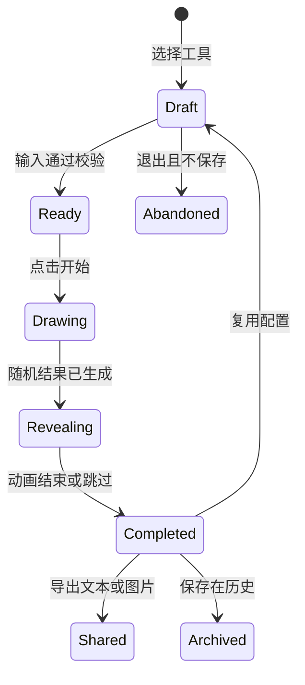
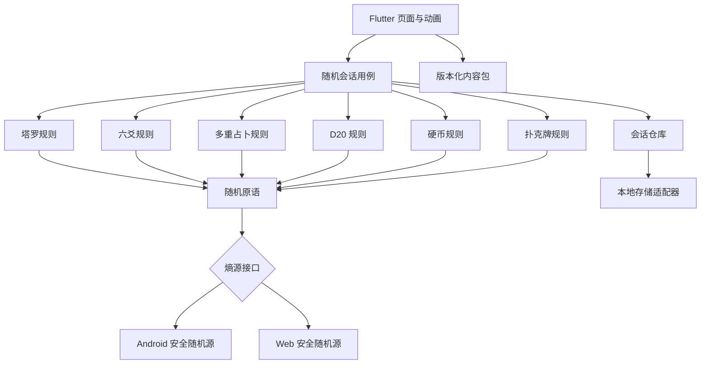

# Pocketools 多场景随机工具产品设计文档

- **文档状态**：v0.1.0 的五工具与可扩展架构增量已冻结并完成本地交付；多重占卜作为当前增量已接入统一注册表。旧 built-in 设计稿已否决，Expanded Round-4 八项资产及十一张活动设计证据已通过独立验收，G1 交互与视觉门禁【PASS】。2026-08-24 交互收口与多重占卜已实现并通过 548 项全量回归（含 Web shell 布局用例）；当前模块细节以[多重占卜设计与实现说明](multi-divination-design.md)为准。设计图仍为 `runtimeAsset=false` 的内部参考，不构成运行时资产或内容许可。
- **产品代号**：Pocketools，中文工作名“随机口袋”。
- **目标平台**：Android、Web/PWA。
- **更新时间**：2026-08-24。
- **范围假设**：“DND 鉴定”指 D20 类桌面角色扮演游戏中的属性、技能或通用检定，不指物品鉴定。

本文档已归档至 `docs/product-design.md`。冻结的逐条需求以『docs/requirements.md』为准，当前交互以『docs/interaction-closure-2026-08-24.md』为准，角色边界与阶段门禁以『docs/project-plan.md』为准。

## TL;DR

- **产品定位**：将塔罗牌、六爻、D20 检定、抛硬币、扑克牌和塔罗／周易多重占卜等随机活动做成一个可信、克制、离线可用的随身工具箱，统一记录输入、随机过程、规则版本和结果。
- **核心体验**：用户应在打开应用后的 3 次交互内完成一次常用随机操作；简单工具可一键出结果，复杂工具通过“快速模式”和“引导模式”兼顾熟练用户与新手。
- **方案一 - Flutter 单代码库**：Android 与 Web 共享界面、领域规则和测试，平台差异收敛在随机源、存储、分享等适配层。【推荐】
- **方案二 - Web/PWA 加 Android 壳**：首发更快、包体和开发链路简单，但复杂动画、原生交互与长期平台一致性较弱。
- **MVP 工具**：塔罗牌支持单牌与三牌阵，`includeMinorArcana` 默认开启并允许切换 78 张或 22 张牌组；六爻支持三枚硬币起卦与本卦/变卦；D20 支持快捷检定、自定义骰子数量/面数/聚合和 DC；硬币支持单次、多次和自定义正反面；扑克牌默认使用不含大小王的标准 52 张牌，用户显式开启后使用 54 张牌，并按目标 `n` 无放回抽取，每次点击一张。
- **MVP 工具**：塔罗牌支持单牌与三牌阵，`includeMinorArcana` 默认开启并允许切换 78 张或 22 张牌组；六爻支持三枚硬币起卦与本卦/变卦；D20 支持快捷检定、自定义骰子数量/面数/聚合和 DC；硬币支持单次、多次和自定义正反面；扑克牌默认使用不含大小王的标准 52 张牌，用户显式开启后使用 54 张牌，并按目标 `n` 无放回抽取，每次点击一张；多重占卜使用六组三张塔罗牌形成六爻，并提供本卦／动爻／变卦与 A1～A6 融合解释。
- **简化页面**：现有玩法页默认只展示顶部核心实体、一个主操作和按玩法显示的重置；高级选项默认折叠，结果摘要与可用解析在同一实体舞台或其下方展开，不改变统一会话、恢复、无障碍或动效契约。
- **反馈原则**：现有随机工具都使用按压、生成、揭示、完成、减少动态效果五态；硬币表现真实感的抛起/翻转/落定，牌类表现洗牌/抽牌，多重占卜只为新增牌组播放局部动画，结果始终先冻结再播放动画或触觉反馈。
- **扩展原则**：工具通过统一 `ToolModule` 注册并复用随机、会话、历史、分享和共享 UI；全局按钮样式由组件与 design tokens 单点控制，工具只通过语义 token 和专属 primitive 表达差异。
- **随机原则**：默认使用平台提供的密码学安全随机源，通过无偏整数抽样驱动洗牌、骰子和硬币；结果页展示算法与规则说明，但不把“本地随机”宣传成可证明未作弊。
- **内容原则**：占卜类结果只提供文化、娱乐和自我反思提示，不给出医疗、法律、财务等确定性建议；D20 规则内容只使用原创内容或符合许可要求的 SRD 内容。
- **数据原则**：MVP 无需登录、无需后端、默认不上传问题和结果；历史记录仅保存在本地，分享前默认隐藏用户问题与备注。
- **商业原则**：核心随机能力永久免费；可通过主题、原创牌面与内容包变现，不售卖“更好运结果”、付费重抽或与现实奖品挂钩的随机机会。
- **交付策略**：统一随机引擎、可扩展模块底座、工具纵向切片、历史、分享、无障碍和本地构建已完成；多重占卜按独立领域／内容／表现层接入；公共渠道、release signing 和商店合规留待后续发布门禁。【本地交付已完成】

## 背景与问题

### 用户问题

需要随机决策或仪式感的用户通常面临以下割裂体验：

- 每种场景需要安装一个独立应用，入口分散，交互和质量不一致。
- 简单随机工具常被广告、登录、网络请求和复杂配置打断。
- 占卜工具容易把娱乐性结果包装成权威结论，缺少明确的能力边界。
- 普通随机应用只展示最终结果，无法说明规则、概率、是否允许重复或如何处理变牌。
- 桌游玩家需要快速、可复查的掷骰记录，但通用随机数工具常缺少可校验的骰池、保留规则、优势/劣势和 DC 判断。
- Web 与 Android 端的历史和分享格式经常不一致，给使用和维护带来额外成本。

### 产品机会

Pocketools 的机会不在于提供更多“神秘解释”，而在于提供一致、可信、随手可用的随机体验：

- 用统一工具箱覆盖高频、短时、低门槛的随机场景。
- 用规则透明、结果可复查和版本可追踪建立信任。
- 用动画、触觉和视觉主题保留不同玩法的仪式感。
- 用模块化规则、共享组件和内容包降低后续增加抽签、转盘、随机数等工具的成本。

### 当前基线

- 【已验证】当前仓库已有完整产品、需求、项目计划、交互/设计资产、六工具 Flutter 业务源码、公共能力、根目录 Makefile 和分阶段独立 QA；多重占卜的规则、解释和恢复边界见[专门设计文档](multi-divination-design.md)，最终验证矩阵、构建产物与非公开发布边界以『发布报告』为准。
- 【假设】首发团队规模较小，因此优先选择单代码库、无后端、离线优先方案。
- 【假设】首发语言为简体中文，数据结构从第一天支持国际化。
- 【已冻结】v0.1.0 只交付本地 Web/PWA 包和 Android debug APK；不声明 Google Play、中国大陆商店或公共 Web 托管已上线。
- 【已冻结】塔罗与六爻首版只使用本项目原创的结构化简释与反思提示，不引入第三方现代译注或长篇解读。

## 目标与非目标

### 产品目标

- 提供统一入口，覆盖塔罗牌、六爻、D20 检定、抛硬币和扑克牌五类首发场景。
- 让用户可以在无账号、无网络条件下完成核心随机流程。
- 确保相同规则版本在 Android 与 Web 上得到一致的规则计算结果。
- 让用户能理解“抽了什么、为什么得到该结果、使用了哪条规则”。
- 让用户在每个玩法页先看到核心实体和一个明确主操作；复杂配置只在主动展开高级选项后出现。
- 支持结果历史、再次使用相同配置、复制文本和生成分享卡片。
- 建立可扩展的工具协议，使新增随机工具不需要修改已有工具的核心逻辑。
- 通过安全随机源、无偏抽样和统计测试避免明显的实现偏差。

### 体验目标

- 常用工具从首页开始不超过 3 次交互得到结果。
- 从点击“开始”到产生随机结果的计算时间目标不超过 100 ms；揭示动画不计入计算时间。【计划】
- 断网时，除在线同步、在线内容更新和云端可验证模式外，全部核心功能可用。
- 结果摘要必须在唯一实体舞台中可见；规则、原始值和版本通过会话、历史或分享载荷追溯，玩法页不渲染独立“查看过程”层。
- Android 小屏、手机浏览器和桌面浏览器都能完成完整流程。

### 非目标

- 不提供真人占卜师、付费咨询、社交匹配或用户社区。
- 不预测医疗、法律、财务、考试、彩票等高风险事件的确定结果。
- 不接收、管理或兑换赌注、奖金、虚拟筹码和现实奖品。
- MVP 不提供账号体系、跨设备同步、多人房间和云端排行榜。
- MVP 不实现六爻纳甲、六亲、世应、旬空、神煞等存在流派差异的完整断卦系统。
- MVP 不做完整虚拟桌面、角色卡、战斗管理或 D&D 全规则百科。
- MVP 不承诺本地结果具备第三方可验证的防作弊能力。

## 产品定位

### 一句话定位

Pocketools 是一个离线优先、规则透明、兼顾效率与仪式感的多场景随机工具箱。

### 产品命名

| 层级 | 推荐名称 | 使用位置 | 说明 |
| :--- | :------- | :------- | :--- |
| 主品牌 | Pocketools | 应用名、域名、包名 | 延续仓库名，便于未来加入非随机小工具 |
| 中文名 | 随机口袋 | 商店副标题、中文首页 | 直接表达用途，避免把产品限定为占卜应用 |
| 塔罗模块 | 塔罗 | 工具卡、深链 | 不在工具名中承诺“预测” |
| 六爻模块 | 六爻起卦 | 工具卡、深链 | 明确 MVP 的动作是起卦，不是自动断卦 |
| D20 模块 | D20 检定 | 工具卡、深链 | 降低商标依赖，同时符合玩家认知 |
| 硬币模块 | 抛硬币 | 工具卡、深链 | 使用最直观的行为名称 |
| 扑克模块 | 抽扑克牌 | 工具卡、深链 | 强调抽取而非牌局、下注或输赢 |

### 差异化原则

- **一个底座，多种仪式**：随机、记录和分享行为一致，各工具保留独立的视觉语言。
- **透明而不扫兴**：默认结果页简洁，用户可展开概率、抽样和规则详情。
- **克制解释**：提供联想与规则，不把随机结果伪装成事实或专业建议。
- **本地优先**：不为核心功能强制注册，不把私人问题上传服务器。
- **允许复查，不鼓励刷结果**：重抽是明确的新会话，历史中保留与原会话的关联。

## 用户与场景

### 目标用户

| 用户类型 | 核心需求 | 使用频率 | 主要阻力 |
| :------- | :------- | :------- | :------- |
| 轻量决策者 | 在两个或多个选项间快速随机 | 高频、短时 | 不想安装复杂应用或看广告 |
| 塔罗兴趣用户 | 抽牌、查看牌义、保存当时的问题 | 中频、带仪式感 | 内容质量参差、结果难复盘 |
| 六爻学习者 | 按三枚硬币法起卦并查看本卦与变卦 | 中低频、学习型 | 阴阳爻顺序、动爻转换容易记错 |
| 桌游玩家/主持人 | 快速完成 D20 检定并保留掷骰明细 | 高频、连续操作 | 通用工具不支持优势/劣势与修正值 |
| 卡牌工具用户 | 从标准牌组抽取指定数量并复查顺序 | 中频、短时 | 常见应用混入赌场语义或无法确认是否无放回 |
| 内容创作者 | 生成美观、去隐私的结果图 | 中频、传播型 | 分享截图样式不统一、容易泄露问题 |

### 关键使用场景

- 用户在通勤途中抽取“今日一牌”，查看简短提示并保存。
- 用户输入一个开放式问题，使用过去/现在/未来三牌阵，逐张翻牌。
- 用户连续抛掷三枚虚拟硬币六次，得到本卦、动爻和变卦。
- 玩家输入 `1d20 + 5`，选择优势，掷出两枚 D20 并比较 DC 15。
- 两个人用硬币决定先后顺序，把正反面改成双方昵称。
- 用户选择不含大小王的标准牌组，无放回抽取 5 张并分享顺序清晰的结果。
- 用户从历史记录复制上一次 D20 配置，再进行一轮新的独立检定。

### 不应服务的场景

- 用户要求应用决定是否停止服药、是否投资或是否采取法律行动。
- 用户购买一次随机机会，以获得现金、实物或可交易数字资产。
- 用户把结果伪装成系统认证、裁判签名或不可篡改证明。
- 未成年人被引导进入博彩服务、付费抽奖或带有博彩导流的广告页面。

## 产品原则

### 快速与引导并存

- 首页长按工具卡或点击“快速开始”时使用上次配置直接生成。
- 正常点击进入配置页，适合首次使用和需要修改规则的用户。
- 首次使用只解释影响结果的关键规则，长篇背景知识放到“了解规则”。

### 结果不可静默改写

- 已完成会话的输入、随机结果和规则版本不可在原记录上修改。
- “再来一次”创建新会话，并记录 `parentSessionId`。
- 用户可删除本地历史，但删除不应改变其他记录的内容。

### 仪式感不能遮挡效率

- 动画默认时长控制在 0.4～1.2 秒，可点击跳过。
- 连续掷骰模式默认关闭长动画，保留简短反馈。
- 系统开启“减少动态效果”时，替换为淡入或立即展示。

### 默认保护隐私

- 问题、备注和自定义选项只保存在本地。
- 分享卡默认不包含问题、备注、精确时间和设备信息。
- 用户主动勾选后才把问题加入分享内容，并在导出前预览。

### 不制造权威感

- 塔罗与六爻使用“提示”“联想”“传统释义”等措辞。
- 不使用“必然”“注定”“准确率”等无法证实的描述。
- 高风险主题触发温和提示，引导用户寻求合格专业人士，但不阻断普通记录功能。

## 信息架构

### 一级导航

移动端使用底部导航，桌面 Web 使用左侧导航：

| 导航项 | 核心内容 | MVP |
| :----- | :------- | :-: |
| 首页（含工具目录） | 最近使用、收藏工具、五个主工具、继续上次配置 | 是 |
| 历史 | 按时间和工具筛选的本地会话 | 是 |
| 设置 | 外观、声音、振动、隐私、随机说明、内容许可 | 是 |

工具目录已并入首页，不再作为独立一级导航或维护第二份工具清单。

### 首页布局

首页按任务优先级从上到下排列：

1. **继续使用**：展示最近一次使用的工具和配置，不直接展示私人问题。
2. **快速工具**：抛硬币、D20 检定、抽扑克牌，强调一步完成。
3. **仪式工具**：塔罗、六爻起卦，强调引导和视觉反馈。
4. **最近结果**：最多三条，可在设置中隐藏。
5. **探索更多**：MVP 中只展示已上线工具，不放不可用占位卡。

### 深链

- `/tools/tarot`：塔罗配置页。
- `/tools/liuyao`：六爻配置页。
- `/tools/d20`：D20 检定页。
- `/tools/coin`：抛硬币页。
- `/tools/cards`：抽扑克牌配置页。
- `/sessions/{id}`：本地会话详情；Web 端仅在当前浏览器中可解析。
- `/share/{payload}`：可选的只读结果载荷；不得包含未显式选择的私人输入。

## 通用交互模型

### 随机会话

所有工具共享一套会话生命周期：



- `Draft` 允许修改问题、参数和显示偏好。
- 进入 `Drawing` 后冻结本次输入和规则版本。
- `Revealing` 只负责展示，不能再次请求随机数改变已生成结果。
- `Completed` 的结果只读；再来一次会创建关联的新会话。
- 未产生结果的草稿默认不进入历史，用户可选择保留复杂配置。

### 通用页面结构

每个工具默认采用“核心实体优先”的简化结构：

1. **核心实体**：顶部由唯一的 `AppEntityStateView` 展示当前玩法的牌堆/牌面、骰子、硬币、爻线或扑克牌堆；其内部的 `AppGenerationStateView` 仅是状态胶囊，生成前只展示中性状态，不能泄露结果。
2. **主操作**：核心实体下只有一个主操作按钮；牌类/六爻按合同提供重置，D20/硬币完成态由主操作执行 reset + reroll，不把重置伪装成另一条随机路径。
3. **高级选项**：默认折叠，主动展开后显示意图、牌阵、起卦方式、骰池、硬币次数或牌组配置；展开和收起不消耗随机值。
4. **结果与解析**：必要结果摘要归属 `AppEntityStateView`；存在塔罗/六爻等解析时，解析位于其下方，不渲染独立“查看过程”层，也不挤入主操作区。

默认简化入口固定如下：

| 工具 | 默认核心实体 | 默认主操作 | 默认配置状态 |
| :--- | :----------- | :--------- | :----------- |
| 塔罗 | 牌堆牌背；完成后为当前牌面 | “抽一张牌” | 单牌、`includeMinorArcana=true`、逆位开启 |
| 六爻 | 三枚硬币与待落位爻线 | “开始起卦” | 自动投币 |
| D20 | 中性骰体 | “掷骰” | 普通 `1d20` |
| 硬币 | 一枚硬币 | “抛一次” | 单次 |
| 扑克牌 | 牌堆牌背；完成后为有序牌面 | “抽一张” | 标准 52 张、不含大小王、本轮目标 3 张 |

塔罗的三牌阵、单牌问答和其他复杂参数仍属于高级选项；选择三牌阵后，`n=3` 只是本轮目标，牌堆每次抽一张，按位置逐次形成可恢复的部分牌阵。

### 通用结果操作

- **再来一次**：复制配置并创建新会话。
- **调整配置**：回到新草稿，不修改旧记录。
- **保存备注**：备注与结果分开存储，可后续编辑。
- **复制文本**：输出无样式的结构化摘要。
- **分享图片**：生成脱敏分享卡，导出前预览。
- **结果追溯**：原始抽取值、转换规则和版本信息写入不可变会话、历史和分享载荷；玩法页不额外渲染“查看过程”入口，避免与顶部实体结果重复。
- **删除记录**：二次确认后从本地移除。
- **重置**：清空当前未提交草稿或从已完成结果创建一个空白新草稿；不删除历史、不改写旧结果、不消耗随机值。

## 功能总览与优先级

| 能力 | M1 设计基线 | M2 MVP | M3 增强版 | 后续 |
| :--- | :---------: | :-----: | :-------: | :--: |
| 安全随机整数与洗牌 | 规则设计 | 是 | 是 | 是 |
| 塔罗单牌/三牌阵 | 设计 | 是 | 是 | 是 |
| 自定义塔罗牌阵 | 否 | 否 | 是 | 是 |
| 六爻三枚硬币起卦 | 设计 | 是 | 是 | 是 |
| 六爻手工录入 | 设计 | 是 | 是 | 是 |
| 六爻高级排盘 | 否 | 否 | 否 | 评估 |
| D20 快捷检定 | 设计 | 是 | 是 | 是 |
| D20 自定义骰池 | 设计 | 是 | 是 | 是 |
| 通用骰子表达式 | 否 | 基础 | 完整 | 是 |
| 单次/多次抛硬币 | 设计 | 是 | 是 | 是 |
| 扑克牌无放回抽取 | 设计 | 是 | 是 | 是 |
| 本地历史与筛选 | 否 | 是 | 是 | 是 |
| 分享文本/图片 | 否 | 是 | 是 | 是 |
| 账号与云同步 | 否 | 否 | 否 | 评估 |
| 云端可验证随机 | 否 | 否 | 设计 | 评估 |
| 内容包与主题包 | 否 | 内置 | 是 | 是 |

## 扩展工具框架

### 候选工具池

首发后的工具按“规则明确、使用频率、与底座复用度、合规风险、内容成本”排序，不以工具数量作为目标：

| 候选工具 | 核心能力 | 底座复用 | 内容成本 | 风险 | 建议优先级 |
| :------- | :------- | :------: | :------: | :--: | :---------: |
| 随机数 | 在区间内生成一个或多个不重复整数 | 高 | 低 | 低 | 高 |
| 抽签/随机选择 | 从用户输入的选项中有放回或无放回抽取 | 高 | 低 | 低 | 高 |
| 转盘 | 以可视化扇区随机选择，支持等权或自定义权重 | 高 | 低 | 中 | 高 |
| 高级骰子规则 | 多段骰式、爆骰、自定义骰面和跨项运算 | 高 | 中 | 低 | 中 |
| 分组工具 | 将名单随机分成指定数量或人数的小组 | 高 | 低 | 低 | 中 |
| 灵感提示 | 从原创写作、绘画或活动提示库抽取内容 | 中 | 高 | 低 | 中 |
| 每日随机挑战 | 按本地日期固定一个结果 | 中 | 高 | 中 | 低 |

### 工具接入协议

每个新工具必须声明以下能力，应用壳据此生成入口、流程和兼容行为：

```dart
final class ToolDescriptor {
  final String id;
  final String ruleVersion;
  final Set<ToolCapability> capabilities;
  final InputSchema inputSchema;
  final SharePolicy sharePolicy;
  final HistoryPolicy historyPolicy;
  final ContentRequirement contentRequirement;
}

enum ToolCapability {
  quickStart,
  presets,
  customLabels,
  batchDraw,
  stepReveal,
  processDetails,
  shareImage,
  contentPack,
}
```

- `batchDraw` 只描述确实支持批量结果的工具能力；塔罗和扑克的 `n` 是本轮目标数量，不是一次性批量动作，物理牌堆每次点击只追加一张。

- 工具提供输入 schema、输入校验、规则执行和结果摘要，不自行实现历史与分享。
- 工具必须声明是有放回抽样、无放回抽样、加权抽样还是确定性日期映射。
- 加权抽样必须在开始前显示权重，禁止隐藏的运营权重改变结果。
- 工具必须提供固定随机向量、边界测试和无障碍结果描述。
- 含用户自由文本的工具必须显式定义分析与分享字段白名单。
- 涉及现实价值、未成年人或专业决策的工具默认拒绝接入，除非完成单独合规评审。

### 新工具准入标准

新工具进入正式版本前必须满足以下条件：

- 与现有工具有明确不同的用户任务，不只是更换名称或动画。
- 规则可以结构化描述，并能够用固定随机序列完全测试。
- 在 Android 与 Web 上具备一致的结果语义。
- 内容、图形和声音资产具备清晰许可。
- 离线时可以完成核心流程，或明确标注为何必须在线。
- 不破坏“结果不可静默改写”和“默认保护隐私”的产品原则。

## 历史、预设与分享

### 历史记录

- 默认按完成时间倒序展示，卡片只显示工具、主结果摘要和相对时间。
- 支持按工具、收藏状态和时间范围筛选；自由文本搜索仅在本地执行。
- 问题与备注默认在列表中折叠，用户进入详情后才展示。
- 同一父会话产生的多次结果显示为会话组，帮助用户识别连续重抽。
- 收藏只改变检索状态，不复制或修改原会话。
- 未开启历史时，首页不展示“最近使用”的私人结果，只保留非敏感配置偏好。

### 预设

- 系统预设包括塔罗牌阵、D20 常用修正和硬币常用次数。
- 用户预设只保存规则配置，不默认保存问题、备注或上次结果。
- 修改系统预设时创建用户副本，应用升级可以安全更新系统预设。
- 删除预设不影响已经完成的历史记录。
- 预设分享进入后续版本，导入前必须展示所有规则和自定义字段。

### 分享文本

不同工具使用稳定、可读且可脱敏的文本模板：

```text
Pocketools · D20 检定
模式：优势
骰点：8, 16（保留 16）
修正：+5
结果：21，达到 DC 15
规则：d20-check/1.0.0
```

- 默认包含工具名、规则摘要、结果、应用名和规则版本。
- 默认排除问题、备注、精确时间、本地 ID、设备和分析标识。
- 用户可在预览中单独开启问题和时间，不提供“一键公开全部隐私字段”。

### 分享图片

- 分享卡使用固定安全边距和高对比文字，支持浅色、深色和工具主题。
- 图片中的牌面或插画只有在对应许可允许再分发时才能导出。
- 图片 metadata 不写入问题、设备路径、定位或内部会话数据。
- 生成失败时回退到文本，不降低图片质量后静默遗漏必要归属信息。
- Web 下载和 Android 系统分享使用平台适配器，领域层只生成分享模型。

### 可分享链接

- MVP 不依赖服务器保存结果，因此不默认生成公开 URL。
- 可选离线载荷只包含结果所需的最小字段，并带 schema、长度上限和校验摘要。
- 链接载荷不是签名证明，打开页必须标注“由分享者提供，未经过服务器验证”。
- 需要可撤销公开链接、访问控制或跨设备历史时，再引入后端存储和隐私策略。

## 塔罗牌详细设计

### MVP 范围

- 内置 78 张牌的数据模型，包括 22 张大阿尔卡那和 56 张小阿尔卡那。
- 支持“今日一牌”“单牌问答”“过去/现在/未来”三种预设。
- 支持 `includeMinorArcana` 牌组范围开关，默认 `true`；开启使用 78 张牌，关闭仅使用 22 张大阿尔卡那。
- 支持开启或关闭逆位；默认开启。关闭后不生成方向随机值。【已冻结】
- 支持逐张揭示、一次揭示、跳过动画。
- 每张牌提供原创或许可明确的关键词、传统象征、正逆位差异、反思问题和内容来源。
- 结果中展示牌阵位置、牌名、正逆位和对应释义；三牌阵提供位置化解释与克制的组合提示。

### 用户流程

1. 用户进入塔罗页，顶部看到牌堆，默认只看到“抽一张牌”和相邻的“重置”。
2. 用户可直接点击一次抽一张牌；一次点击只产生一张冻结牌，不要求先展开配置。
3. 用户主动展开“高级选项”后，可选择牌阵、`使用小阿卡纳牌` 和逆位；问题仍为可选字段。
4. 系统冻结配置，安全洗牌后按牌阵顺序抽取且不放回。
5. 用户翻开冻结的牌面，结果卡位于主操作区下方；解析和反思提示继续位于结果下方。
6. 用户可写反思备注、保存结果或导出脱敏分享卡；“重置”只创建空白草稿，不改写已完成结果。

### 抽牌规则

- `includeMinorArcana=true` 时使用 78 张完整牌组；`false` 时只对 22 张大阿尔卡那洗牌。两种范围均使用 Fisher–Yates 算法进行无偏洗牌。
- 同一会话内抽牌不放回，不允许出现重复牌。
- 开启逆位时，每张已抽牌独立获取一个均匀的二值结果。
- 牌阵位置先于抽牌固定，不能根据抽到的牌动态改变位置含义。
- 关闭逆位时不产生逆位随机值，过程详情应明确这一配置。
- 关闭小阿尔卡那时不读取小阿尔卡那的牌面或解释内容；开关、牌组大小和范围标签写入会话、历史和分享。

### 牌阵定义

| 牌阵 | 牌数 | 位置 | 默认场景 |
| :--- | :--: | :--- | :------- |
| 今日一牌 | 1 | 今日提示 | 日常反思 |
| 单牌问答 | 1 | 核心信息 | 开放式问题 |
| 三牌阵 | 3 | 过去、现在、未来 | 观察事件发展 |

### 内容结构

每张牌的内容不直接拼成一个长答案，而是按层次展示：

- **第一层**：牌名、正逆位、3～5 个关键词。
- **第二层**：传统象征及正位/逆位差异；关闭逆位时不展示与当前结果无关的逆位结论。
- **第三层**：不超过 120 字的位置化解释；三牌分别绑定过去、现在、未来。
- **组合层**：三牌可提示重复主题、张力和可能的观察方向，但不得把牌面组合写成必然事件。
- **反思层**：1～3 个开放式反思问题。
- **来源层**：内容包名称、作者、版本和许可。
- **边界层**：持续展示“内容用于娱乐、文化学习和自我反思，不是专业建议”。
- **牌组层**：显示“22 张大阿尔卡那”或“78 张牌（含小阿尔卡那）”；解析只能引用当前牌组中实际抽到的牌。

### 边界与异常

- 用户未输入问题时允许抽牌，结果中不显示空问题区域。
- 小阿尔卡那开关默认开启，文案固定为“使用小阿卡纳牌”；关闭时显示“仅使用 22 张大阿尔卡那”，不改变单牌/三牌阵的抽取数量。
- 内容包缺少某张牌的逆位解释时，回退到通用逆位提示并记录内容缺失事件。
- 小阿尔卡那牌面或解释缺少许可时，保留稳定文字结果并禁用受影响图片分享；不得替换牌、重新抽牌或把候选许可写成已批准。
- 动画中退出页面时，已生成结果进入历史，避免返回后重新抽取。
- 分享时默认只展示牌阵、牌面和关键词，不展示完整问题与备注。
- “是/否占卜”不进入 MVP，避免把复杂问题压成确定性结论。

## 六爻起卦详细设计

### MVP 范围

- 支持三枚硬币法自动起卦。
- 支持用户手工录入每一爻，适配实体硬币或线下起卦。
- 按自下而上的顺序生成初爻至上爻。
- 展示六次投掷明细、本卦、动爻和变卦。
- 提供卦名、卦象、基础卦辞/爻辞或原创简释，具体内容取决于许可范围。
- 提供上下卦、卦象基础以及动爻/变卦的结构解释，区分传统原文、现代改写与原创简释。
- 不在 MVP 自动完成纳甲、六亲、世应、用神和吉凶断语。

### 三枚硬币规则

产品固定使用以下可见规则，避免不同页面采用不同口径：

- 正面记 3，反面记 2。
- 三枚硬币之和为 6：老阴，阴爻，动爻，变为阳。
- 三枚硬币之和为 7：少阳，阳爻，静爻。
- 三枚硬币之和为 8：少阴，阴爻，静爻。
- 三枚硬币之和为 9：老阳，阳爻，动爻，变为阴。

| 和值 | 名称 | 本卦爻 | 是否变化 | 变卦爻 | 理论概率 |
| :--: | :--- | :----- | :------: | :----- | :------: |
| 6 | 老阴 | 阴 | 是 | 阳 | 1/8 |
| 7 | 少阳 | 阳 | 否 | 阳 | 3/8 |
| 8 | 少阴 | 阴 | 否 | 阴 | 3/8 |
| 9 | 老阳 | 阳 | 是 | 阴 | 1/8 |

### 用户流程

1. 用户可选填问题和起卦备注。
2. 用户选择“自动投币”或“手工录入”。
3. 自动模式每轮独立抛三枚硬币，动画结束后锁定该爻。
4. 页面从底部向上堆叠六爻，并标注当前是第几爻。
5. 完成六爻后计算上下卦、本卦、动爻和变卦。
6. 结果页先展示卦象，再按需展开六次投掷和内容解释。

### 卦象计算

- 内部统一以长度为 6 的数组表示六爻，索引 0 永远是初爻。
- 阳爻编码为 `1`，阴爻编码为 `0`。
- 下卦由索引 `0..2` 构成，上卦由索引 `3..5` 构成。
- 变卦仅翻转和值为 6 或 9 的爻。
- 卦名查找使用经过测试的 64 卦映射表，不依赖界面文案推算。
- 展示层从上爻画到初爻，但数据层始终保持自下而上的顺序。

### 解释结构

- **卦名与上下卦**：先显示稳定卦 ID、卦名、上卦、下卦和六爻图，帮助用户理解卦象如何组成。
- **卦象基础**：以原创或许可明确的短文说明传统象征和结构，不把抽象意象包装成事实预测。
- **动爻与变卦**：逐项说明哪些爻发生变化、如何翻转以及变卦如何由本卦得到；无动爻时明确“本卦不变”。
- **文本来源**：传统原文、现代改写、原创简释分别显示来源、作者、版本和许可状态；许可未闭环的文本不得进入发布内容包。
- **能力边界**：不扩展到完整纳甲、六亲、世应、用神或自动断卦；持续展示文化娱乐免责声明，高风险主题只给通用安全提示。

### 边界与异常

- 手工录入允许撤销最后一爻，但完成后修改会创建新草稿。
- 自动模式在单爻动画期间禁止重复点击，随机值只生成一次。
- 全部为静爻时不生成独立变卦卡，显示“无动爻，本卦不变”。
- 六爻内容必须标注传统文本、现代改写和原创解释的来源边界。
- 若未来加入时辰、干支和排盘，必须新增独立规则版本，不能静默改变旧记录。

## D20 检定详细设计

### MVP 范围

- diceCount 支持 1～20。
- diceSides 提供 D4、D6、D8、D10、D12、D20、D100 快捷值，并允许自定义 2～1000。
- aggregation 支持 sum、keepHighest K、keepLowest K，K 为 1～diceCount。
- 普通、优势、劣势是统一骰池模型的快捷预设。
- 支持整数 modifier 和可选难度等级 DC。
- 显示每一枚原始骰、保留骰、舍弃骰、聚合方式、modifier、total 和 DC 判断。
- 数量、面数和 K 同时支持步进器与键盘输入。
- 支持最近配置和连续掷骰模式。
- 提供可映射到统一骰池模型的基础表达式，但不执行任意脚本语言。

### 预设与自定义模式

| 模式 | diceCount | diceSides | aggregation | 模式标签规则 |
| :--- | :-------: | :-------: | :---------- | :----------- |
| 普通 | 1 | 20 | sum | 参数未修改时显示“普通” |
| 优势 | 2 | 20 | keepHighest 1 | 参数未修改时显示“优势” |
| 劣势 | 2 | 20 | keepLowest 1 | 参数未修改时显示“劣势” |
| 自定义 | 1～20 | 2～1000 | sum、keepHighest K、keepLowest K | 用户修改任一数量、面数或保留规则后显示“自定义” |

模式标签只描述当前配置，不是独立规则分支。快捷预设和自定义模式都写入相同的结构化输入。

### 配置与检定流程

1. 用户选择普通、优势、劣势快捷预设或直接进入自定义配置。
2. 用户通过步进器或键盘输入调整 diceCount、diceSides、aggregation 和 K。
3. 用户输入 modifier，可选输入 DC 和检定名称。
4. 系统校验所有参数；用户开始后冻结输入、规则版本和模式标签。
5. 系统按生成顺序得到全部原始骰，再按 aggregation 标记保留骰与舍弃骰。
6. total 等于保留骰求和加 modifier；输入 DC 时展示“达到/未达到”，未输入时只展示 total。
7. 结果页允许展开全部原始骰、保留规则、聚合过程和规则版本。

### 标准规则与房规

- 默认的“属性/技能检定”模式不把自然 20 或自然 1 自动判定为成功或失败。
- v0.1.0 不把自然 1/20 房规作为自定义骰池的隐式行为；未来若加入，必须使用独立开关和规则版本。
- 攻击检定、豁免检定和死亡豁免具有不同语义，若后续支持，应拆成独立模式。
- 所有规则判断在结果生成前固定，不能在看到骰点后切换房规改变结论。

### 聚合规则

- sum 保留全部原始骰。
- keepHighest K 按骰值从高到低选择 K 枚；同值时按较早生成顺序优先。
- keepLowest K 按骰值从低到高选择 K 枚；同值时按较早生成顺序优先。
- K 只在 keepHighest 和 keepLowest 下出现，范围为 1～diceCount。
- 每枚骰保留 sequence、rawValue 和 kept 状态，结果、历史与分享使用同一份过程数据。

### 骰子表达式

MVP 支持以下可控子集，表达式与页面控件写入同一结构化模型：

- NdS：映射为 sum。
- NdS+M 或 NdS-M：映射为 sum 和 modifier。
- NdSkhK+M：映射为 keepHighest K。
- NdSklK+M：映射为 keepLowest K。

解析限制如下：

- N 范围为 1～20，S 范围为 2～1000，K 范围为 1～N，modifier 范围为 -9999～9999。【计划】
- 输入大小写不敏感，空格可忽略。
- 拒绝嵌套表达式、变量、函数和无限爆骰，避免性能与安全问题。
- 解析失败时指出错误位置，并保留用户输入。

### 边界与异常

- 数量、面数、K、modifier 和 DC 必须在开始前完成整数与范围校验。
- 同值骰全部展示，保留选择按稳定 sequence 规则执行。
- 从快捷预设修改数量、面数或聚合后立即显示“自定义”，恢复完全相同预设参数后恢复对应快捷标签。
- DC 必须为整数；超出支持范围时在开始前阻止生成。
- 连续模式中的每次点击都是独立会话，可按组折叠展示。
- 分享卡显示规则与原始骰，避免只展示一个无法复查的总值。
- 产品对外称为“D20 检定”或“5E 兼容工具”；若使用 SRD 内容，必须按许可提供归属说明。

## 抛硬币详细设计

### MVP 范围

- 支持抛 1 次、3 次、5 次、10 次或自定义 1～100 次。
- 支持自定义正反面文案，例如“吃面/吃饭”“A/B”。
- 支持展示每次结果、正反面计数和比例。
- 支持“率先达到 N 次”模式，适合三局两胜或五局三胜。
- 支持关闭动画后快速连续抛掷。

### 规则

- 每枚硬币由一个独立、均匀的二值随机值决定。
- 默认 `0` 映射为正面，`1` 映射为反面；映射只影响显示，不影响概率。
- “率先达到 N 次”逐次产生结果，到任一面达到目标后立即停止。
- 自定义文案只修改标签，历史中同时保存原始面值，避免文案改变后无法解析。

### 边界与异常

- 两个自定义标签不得完全相同，去除首尾空格后再校验。
- 空标签回退到“正面/反面”。
- 自定义抛掷次数超过界面上限时不开始生成。
- 结果动画中再次点击不会重新产生随机值。

## 扑克牌详细设计

### MVP 范围

- 使用标准 52 张牌组：黑桃、红桃、方块、梅花各包含 A、2～10、J、Q、K。
- 提供“包含大小王”开关，对应 `includeJokers`；默认值为 `false`，使用标准 52 张牌，用户显式开启后加入 2 张具有不同稳定 ID 的大小王，总数为 54 张。
- 用户可设置抽取数量 n，范围为 1～当前牌组大小，并同时支持步进器和键盘输入；n 只表示本轮目标数量。
- 一次会话按目标 n 无放回累计抽取；物理交互每次只追加一张，不把一次点击作为批量动作，部分结果也展示抽取顺序、每张牌的稳定标识和剩余牌数。
- 支持历史详情、重新抽取和脱敏分享；重新抽取始终创建新会话。

### 抽取流程

1. 新草稿默认 `includeJokers=false`；用户可显式开启“包含大小王”，并设置 n。
2. 界面校验 n 与当前牌组大小，显示冻结前摘要。
3. 用户开始后冻结牌组配置、n、规则版本和算法版本。
4. 统一随机核心从当前可用牌组无放回取一张；该张结果立即写入可恢复会话，直到达到目标 n。
5. 界面只为本次新增牌播放洗牌/抽牌动画，已有牌保持静止。
6. 结果页按 sequence 展示已抽牌、目标 n、牌组配置、剩余牌数、历史与分享入口。

### 牌组与结果规则

- 标准牌 ID 由花色与点数组合；两张大小王使用不同稳定 ID，不依赖展示文案作为主键。
- `includeJokers` 默认 `false`；未显式开启时必须构建 52 张牌组，显式开启后才构建 54 张牌组。
- n 必须为整数；小于 1 或大于当前 52/54 张牌组时不创建会话、不消耗随机值。
- 同一目标会话的抽牌序列无放回，结果不得重复；抽完整牌组时剩余牌数为 0。
- 完成会话的牌组配置、抽取顺序和结果不可修改；重新抽取通过 parentSessionId 关联但不复用旧随机值。
- Android、Web、历史和分享消费同一结构化牌序，不根据布局、动画或本地化重新排序。

### 视觉与内容边界

- 牌面只使用原创或许可明确的抽象标准花色符号、点数和大小王标记。
- 不使用赌场桌面、筹码、下注、赔率、现金、荷官或输赢文案；工具定位是随机抽取，不模拟真钱牌局。
- 牌背、字体、花色图标、音效和生成式设计参考分别记录来源、用途和许可状态；未确认再分发权限时不得进入发布产物或分享卡。
- 洗牌和抽牌动画不模拟结果来源；减少动态效果时改为短淡入或立即按冻结顺序展示。

## 多重占卜详细设计

多重占卜是塔罗牌与周易六爻的组合玩法，完整规则、解释优先级、会话字段和验收证据见[多重占卜设计与实现说明](multi-divination-design.md)。本节保留产品层摘要，避免把融合规则散落到多个页面。

### 产品范围

- 使用 78 张完整塔罗牌，一次会话只洗牌一次。
- 每次点击牌堆抽取 A、B、C 三张牌；最多六组，依次对应初爻到上爻，共 18 张不重复牌。
- 每组正位数量 0、1、2、3 分别映射为 6、7、8、9；6/9 为动爻，变卦由动爻阴阳翻转得到。
- 标准解释只使用 A1～A6，B/C 保留为随机输入；主卦、动爻、变卦和 A 牌摘要构成可追溯输出。
- 解释只提供文化、娱乐和自我反思提示，不提供高风险确定性结论。

### 产品体验

初始页面只展示一个有厚度的牌堆。用户点击牌堆后，应用先保存一组三张牌，再在顶部实体舞台中播放新增牌的抽出和翻面；已有牌不重播、不移动。点击 A 牌复用塔罗释义弹层，完成六组后将卦象和 A1～A6 摘要直接合并到顶部实体区域，详细解释在同页下方展示，不引入第二个结果动画舞台。

高级选项默认折叠，当前会话开始后仍可编辑，修改内容只在下一轮生效。返回、刷新和后台恢复都通过保存的一次性牌序继续，不重新洗牌或重新取已使用的牌。该模块沿用 `ToolModule`、`AppEntityStateView`、`AppPhysicalDeck`、会话 codec 和共享设计 token，新增模块不需要改写应用 shell。

## 统一随机引擎

### 设计目标

- 为所有工具提供统一、安全、无偏、可测试的随机原语。
- 将“获取随机字节”“映射为随机整数”“应用玩法规则”“展示结果”彻底分离。
- 让规则引擎可在单元测试中注入固定随机序列，复现任何边界情况。
- 通过算法版本保留旧会话语义，避免升级后无法解释历史结果。

### 分层架构



### 核心接口

```dart
abstract interface class EntropySource {
  Uint8List nextBytes(int length);
}

abstract interface class RandomGenerator {
  int nextInt(int maxExclusive);
  bool nextBool();
  List<T> shuffled<T>(List<T> input);
}

abstract interface class ToolRule<I, O> {
  String get ruleVersion;
  O execute(I input, RandomGenerator random);
}
```

- `EntropySource` 只获取平台安全随机字节，不理解牌、爻或骰子。
- `RandomGenerator` 提供无偏整数、布尔值和洗牌。
- `ToolRule` 是纯规则层，同一输入和同一注入序列必须生成同一输出。
- 动画层只消费已经生成的输出，不能直接访问随机源。

### 无偏整数抽样

若底层只提供随机字节，不直接使用 `randomValue % n`，因为当随机空间不能被 `n` 整除时会产生模偏差。推荐算法如下：

1. 读取 4 字节并解释为无符号 32 位整数 `x`。
2. 计算 `limit = 2^32 - (2^32 mod n)`。
3. 若 `x >= limit`，丢弃该值并重新读取。
4. 返回 `x mod n`。

### 随机模式

| 模式 | 用途 | 优点 | 局限 | 版本 |
| :--- | :--- | :--- | :--- | :--- |
| 本地安全随机 | 默认抽牌、起卦、骰子、硬币 | 离线、快速、不依赖服务器 | 无法向第三方证明用户没有重抽 | MVP |
| 可复现种子 | 分享可复现示例、测试 | 跨端可复现、易排查 | 种子公开后结果可预测 | M3 评估 |
| 云端承诺-揭示 | 多人公平场景 | 可验证服务器未在看到输入后改结果 | 需要后端，仍无法阻止服务器拒绝服务 | 后续评估 |

### 公平性声明

- MVP 可以证明实现使用了安全随机 API，并通过测试验证分布没有明显偏差。
- MVP 不能证明设备、构建包或用户本人未修改结果。
- 本地哈希链只能发现部分记录损坏或普通编辑，不能作为恶意篡改的密码学证明。
- 结果页应使用“随机过程说明”，不使用“绝对公平”“不可操纵”等过度承诺。

### 会话过程记录

每次会话保存以下可复查信息：

- 工具标识和规则版本。
- 用户确认后的结构化输入。
- 原始离散结果，例如牌索引、三枚硬币、每枚骰点。
- 从原始结果到最终展示值的转换过程。
- 内容包版本和语言。
- 创建、完成时间以及父会话标识。
- 算法版本和随机模式，不保存可用于倒推出其他会话的全局内部状态。

## 技术方案

### 候选方案

#### 方案一 - Flutter 单代码库

Android 与 Web 使用一个 Flutter 应用，共享领域模型、界面组件和大部分自动化测试。

- **优点**
  - 一套 Dart 规则代码可以覆盖 Android 与 Web，降低跨端规则漂移。
  - 适合牌面翻转、骰子和硬币等高交互、重视觉场景。
  - Flutter 官方将 Android 与 Web 都列为支持的部署目标。
  - 后续增加 iOS 或桌面端时具备自然扩展路径。
- **缺点**
  - Web 首包、搜索引擎文档体验和平台细节需要额外优化。
  - 某些存储、分享和文件插件需要确认 Web 支持或编写适配器。
  - 团队需要具备 Dart/Flutter 能力。
- **适用条件**
  - 产品重视跨端一致动画和长期维护成本。
  - Web 主要是应用型体验，而不是需要大量搜索引擎收录的内容站。

#### 方案二 - Web/PWA 加 Android 壳

使用响应式 Web 技术实现产品，并通过 Trusted Web Activity 或 WebView 形态发布 Android。

- **优点**
  - Web 开发和发布链路短，静态托管成本低。
  - 内容页、分享落地页和搜索引擎优化更自然。
  - 前端人才和生态选择更广。
- **缺点**
  - Android 上的触觉、分享、后台恢复和系统集成体验较弱。
  - Web 壳与浏览器兼容问题可能进入主体验链路。
  - 若后续转为原生体验，可能出现第二套界面实现。
- **适用条件**
  - 首要目标是快速验证 Web 用户需求。
  - Android 仅作为安装入口，不追求明显的原生差异化体验。

### 方案汇总

| 方案 | 跨端规则一致性 | 动画与交互 | Web 内容能力 | 长期维护 | 结论 |
| :--- | :------------: | :---------: | :----------: | :-------: | :--- |
| Flutter 单代码库 | 高 | 高 | 中 | 一套主代码 | 推荐 |
| Web/PWA 加 Android 壳 | 中高 | 中 | 高 | Web 为主，原生能力另接 | 备选 |

### 推荐架构

- **客户端**：Flutter 应用，启用 Android 与 Web 目标；应用 shell 只读取统一工具注册表，不依赖具体工具实现。
- **领域层**：纯 Dart，实现随机原语、规则引擎、会话模型和内容模型。
- **状态管理**：使用单向数据流；具体依赖在技术验证时从支持 Android/Web 且维护活跃的方案中选择。【待确认】
- **本地存储**：通过 `SessionRepository` 抽象；Android 适配 SQLite，Web 适配 IndexedDB 或等价持久化能力。
- **内容存储**：内置版本化 JSON 内容包和本地图片资产；内容包构建时完成 schema 校验。
- **后端**：MVP 无后端；静态 Web 资源可部署至任意支持 HTTPS 与缓存控制的托管服务。
- **分析**：默认只收集不含问题与结果的匿名产品事件；用户可关闭，具体 SDK 待隐私评审后选择。【待确认】

### 工具模块与共享集成

每个工具实现统一 `ToolModule`，由 composition root 显式注册。应用 shell、导航、历史和分享只消费协议，不通过工具 ID 分支调用具体页面或规则。

```dart
abstract interface class ToolModule<I, O> {
  ToolDescriptor get descriptor;
  ToolRule<I, O> get rule;
  ToolInputCodec<I> get inputCodec;
  ToolOutcomeCodec<O> get outcomeCodec;
  ToolUiFactory<I, O> get ui;
}
```

- `ToolDescriptor` 声明稳定 ID、路由、能力、内容要求、输入 schema、分享策略和历史摘要能力。
- `ToolRule` 只能使用注入的统一随机接口，不能访问页面状态、系统时间、网络或模块私有随机源。
- 输入和结果通过统一会话 envelope 进入存储、历史详情、复制和分享预览；工具只提供类型化 codec 和摘要渲染信息。
- 新增工具的正常改动范围应限定为模块自身、模块测试、内容/许可记录和一处注册声明，不修改应用 shell、通用会话状态机、随机核心、历史页或分享页。
- 架构测试使用 fake 工具模块验证发现、路由、模拟会话、历史和分享集成，并阻止工具反向依赖应用 shell。

### 共享 UI 与设计 tokens

- 应用壳、按钮、输入、步进器、会话状态、结果卡、过程详情、分享预览和错误状态使用共享组件，不在各工具重复实现。
- 全局颜色、排版、间距、圆角、阴影、按钮状态、焦点和动效基线来自 design tokens；调整全局按钮样式只修改 token 或共享组件。
- 工具差异通过语义 token 表达，例如 `tool.tarot.accent`、`tool.coin.material`，不得复制一套仅换颜色的公共组件。
- 只有确实承担独特交互语义的视觉单元可以作为专属 primitive，例如塔罗牌、六爻爻线、骰子、硬币和扑克牌；其容器、状态、可访问语义和操作仍复用共享协议。
- 一次性页面代码、重复的会话状态判断和散落的硬编码样式属于架构缺陷，必须在 M2 退出前清理或由项目经理书面批准例外。

### 推荐目录结构

```text
pocketools/
  apps/
    pocketools_app/
      lib/
        app/
        features/
          tarot/
          liuyao/
          d20/
          coin/
          playing_cards/
          history/
          settings/
        shared_ui/
        platform/
      android/
      web/
  packages/
    random_core/
    tool_rules/
    session_store/
    content_model/
    design_system/
  content/
    zh-CN/
      tarot/
      liuyao/
    licenses/
  test_vectors/
  docs/
  Makefile
```

### 架构约束

- `random_core` 不依赖 Flutter，确保可以快速执行大量统计测试。
- `tool_rules` 不读取系统时间、网络、界面状态或全局随机对象。
- 各 `feature` 只能通过会话用例获取结果，不能直接调用平台随机 API。
- 内容包与规则代码分离，修改文案不会改变随机结果。
- 平台特有代码只出现在 `platform` 和具体适配器中。
- 所有持久化对象包含 `schemaVersion`，所有玩法结果包含 `ruleVersion`。
- `ToolModule` 注册表是工具发现的唯一来源，应用 shell 不维护平行工具清单。
- 公共视觉与行为只从共享组件和 design tokens 读取；专属 primitive 不得重新实现通用按钮、表单、会话或结果卡。
- 根目录 Makefile 在开发阶段提供本地与 CI 一致的薄封装入口；目标合同以『docs/requirements.md』的『Makefile 命令契约』为准，当前不虚构命令配方或验证结论。

## 数据设计

### 核心实体

| 实体 | 作用 | 关键字段 |
| :--- | :--- | :------- |
| `ToolDefinition` | 描述工具入口和能力 | `id`、`nameKey`、`category`、`capabilities` |
| `RandomSession` | 一次不可变随机活动 | `id`、`toolId`、`input`、`outcome`、`ruleVersion` |
| `DrawRecord` | 原始抽取过程 | `sequence`、`kind`、`rawValue`、`mappedValue` |
| `UserNote` | 可编辑的私人备注 | `sessionId`、`text`、`updatedAt` |
| `Preset` | 可复用配置 | `toolId`、`name`、`inputTemplate` |
| `ContentPack` | 版本化牌义或卦义内容 | `id`、`locale`、`version`、`license` |
| `UserSettings` | 本地偏好 | 主题、声音、振动、动画、隐私、语言 |

塔罗会话的 `input` 至少包含以下冻结字段：

- `spread`：单牌或三牌阵的稳定预设 ID。
- `includeMinorArcana`：布尔值，默认 `true`；同时保存 `deckSize`（22 或 78）。
- `allowReversals`、问题和揭示方式；问题为空时不写入空展示字段。

结果、历史、分享和恢复都消费同一组字段；“重置”不会把旧会话的 `outcome` 或 `draws` 复制到新草稿。

### 会话示例

```json
{
  "schemaVersion": 1,
  "id": "01J...",
  "toolId": "d20_check",
  "ruleVersion": "d20-check/1.0.0",
  "algorithmVersion": "secure-rng/1.0.0",
  "createdAt": "2026-08-22T14:20:00Z",
  "completedAt": "2026-08-22T14:20:02Z",
  "input": {
    "mode": "custom",
    "diceCount": 4,
    "diceSides": 20,
    "aggregation": {
      "type": "keepHighest",
      "count": 3
    },
    "modifier": 5,
    "dc": 35,
    "houseRuleCriticalCheck": false
  },
  "draws": [
    {"sequence": 0, "kind": "die", "sides": 20, "rawValue": 8, "kept": true},
    {"sequence": 1, "kind": "die", "sides": 20, "rawValue": 16, "kept": true},
    {"sequence": 2, "kind": "die", "sides": 20, "rawValue": 4, "kept": false},
    {"sequence": 3, "kind": "die", "sides": 20, "rawValue": 12, "kept": true}
  ],
  "outcome": {
    "kept": [16, 12, 8],
    "discarded": [4],
    "keptSum": 36,
    "total": 41,
    "passed": true
  },
  "contentPackVersion": null,
  "parentSessionId": null
}
```

### 扑克牌会话示例

```json
{
  "schemaVersion": 1,
  "id": "01J...",
  "toolId": "playing_cards",
  "ruleVersion": "playing-cards/1.0.0",
  "algorithmVersion": "secure-rng/1.0.0",
  "input": {
    "includeJokers": false,
    "drawCount": 3,
    "deckSize": 52
  },
  "draws": [
    {"sequence": 0, "kind": "card", "cardId": "spades.a"},
    {"sequence": 1, "kind": "card", "cardId": "hearts.10"},
    {"sequence": 2, "kind": "card", "cardId": "clubs.k"}
  ],
  "outcome": {
    "cardIds": ["spades.a", "hearts.10", "clubs.k"],
    "remainingCount": 49
  },
  "parentSessionId": null
}
```

该示例只冻结字段语义，不声明最终序列化库、文件路径或实现已经完成。

### 数据保留与删除

- 历史默认仅保存在当前设备或浏览器。
- 用户可关闭历史；关闭后，新结果只保留到页面退出。
- 用户可按单条、工具类型、时间范围或全部删除。
- Web 清理站点数据、无痕模式或浏览器存储回收会导致历史丢失，设置页需明确说明。
- 若未来加入云同步，必须单独征得同意，并提供导出和账号删除能力。

### 数据迁移

- 读取时按 `schemaVersion` 逐级迁移，不原地猜测未知字段。
- 无法迁移的记录以只读原始 JSON 导出，不静默丢弃。
- 规则版本升级不重算历史结果。
- 内容版本缺失时保留原始结果，并提示当前解释来自不同版本。

## 内容系统

### 内容包组成

每个内容包至少包含：

- 唯一 `packId`、语种、语义版本和发布日期。
- 条目数据、资源索引和 schema 版本。
- 作者、版权方、许可证、归属声明和来源链接。
- 支持的工具、规则版本范围和缺失字段回退策略。
- 构建时校验结果和内容摘要哈希。

### 内容审核

- **准确性**：牌名、卦名、爻位和规则映射由第二人复核。
- **版权**：文字、字体、插画、音效和图标分别记录来源与许可。
- **安全性**：过滤绝对化预测、恐吓、歧视和高风险专业建议。
- **一致性**：同一概念在简短释义、详细释义和分享卡中使用一致术语。
- **可理解性**：首次出现“逆位”“动爻”“优势”等术语时提供短解释。

### 版权边界

- 塔罗牌名和基本结构可作为规则数据处理，但具体牌面插画、现代书籍释义和数字修复图可能受版权保护。
- `includeMinorArcana` 只控制已登记内容和牌面集合，不代表小阿尔卡那资产已获授权；56 张小阿尔卡那的文字、牌面和分享素材必须逐项记录来源、归属、衍生方式和再分发许可，许可未闭环时只能提供稳定文字结果和明确图片降级。
- 六爻与《周易》的具体现代译文、注释和排版可能受版权保护，应使用原创改写、明确公版来源或取得授权。
- D20 模块如引用 SRD 文本，应只使用对应 SRD 明确授权的内容，并在应用“许可与归属”页面放置要求的归属声明。
- 扑克牌的标准花色与点数使用抽象符号表达；具体牌背、字体、插画和音效仍需逐项确认原创或许可，不因“标准牌面”名称而推定资产可自由使用。
- 产品名、图标和商店文案不应暗示得到 Wizards of the Coast 或其他权利方官方背书。
- 【风险】不同国家和商店对占卜、博彩暗示、未成年人和广告的规则不同，上线前需要按目标市场逐项复核。

## 视觉与交互设计

### 整体视觉方向

主应用采用“现代工具箱”而不是“全局神秘学”视觉：

- 基础界面使用中性深浅色主题，确保 D20、硬币和扑克牌不会被塔罗风格压制。
- 各工具通过强调色、纹理和动画区分，但共享间距、字体、按钮和结果卡结构。
- 塔罗可使用深紫与金色；六爻使用墨色与暖白；D20 使用蓝绿高对比色；硬币使用橙黄与石墨色；扑克牌使用朱红、墨黑与中性纸张色。
- 所有信息不能仅靠颜色表达，正逆位、动爻和成功状态需要文字或图形辅助。

### 交互设计稿准入

- 【已否决】此前使用 built-in 图像生成能力产出的设计稿质量不满足 v0.1.0，不得作为布局、视觉、动效或开发还原依据。
- 【已验证】活动设计稿由平台 imagegen 的 gpt-image-2 生成任务产出；原始栅格尺寸、提示词、生成路径、SHA-256 和确定性 4K 评审副本均已记录。平台未返回可机器验证的底层模型版本元数据，因此生成记录明确保留该可验证边界，不把后处理副本写成模型原生 4K。
- 【已验证】设计证据覆盖移动端核心体验、五个工具的动效静态分镜、DND/D20 自定义骰池配置与结果、扑克配置与结果、塔罗解释页、六爻解释页和桌面响应式布局。
- 【已验证】塔罗、六爻、D20、硬币和扑克牌分别定义按压、生成、揭示、完成和减少动态效果五种状态，并说明结果冻结、振动开关和 Web 能力降级。
- 【已验证】视觉体现现代界面层级、一致组件、克制材质与连续状态；失败稿和被替代稿仍完整保留为审计证据。
- 交互文档和设计 tokens 是组件尺寸、间距、颜色、排版、时长、缓动、焦点顺序与响应式断点的精确基线；图像稿不得替代数值定义。
- 【PASS】Expanded Round-4 八项资产和十一张活动设计证据已通过独立交互验收；G1 只放行交互与视觉实现参考。所有生成图仍为 `runtimeAsset=false` 的内部参考，待 PM 最终许可复核，不进入发布内容包。

### 关键组件

- `ToolCard`：图标、名称、一句话用途、最近配置入口。
- `AppEntityStateView`：唯一实体舞台，承载牌堆/牌面、骰子、硬币、爻线或扑克牌堆、状态、动画和必要结果摘要；内部的 `AppGenerationStateView` 仅作为状态胶囊，生成前只呈现中性状态。
- `AppPhysicalAction`：D20/DND、硬币和六爻共用的实体命中区与 `primaryAction` 协议。
- `AppPhysicalDeck` + `AppDeckResultFlow`：塔罗和扑克共用的牌堆入口与有序结果流；每次点击只追加一张。
- `PrimaryActionBar`：只包含当前页一个主操作和相邻“重置”；重置不是随机操作，也不触发动画结果。
- `AdvancedOptionsDisclosure`：默认折叠，承载问题、牌阵、`includeMinorArcana`、逆位、骰池、次数和牌组等配置。
- `IntentField`：可选问题/备注，带隐私提示。
- `RuleSelector`：分段选择、diceCount/diceSides/K 步进器与键盘输入、aggregation 选择和表达式输入。
- `DeckSelector`：默认关闭的“包含大小王”开关、n 步进器与键盘输入、52/54 张牌组摘要。
- `AppResultCard`：实体舞台内的主结果摘要和最小必要解释。
- 历史/调试详情：仅用于历史或调试语义；首版玩法主体不渲染独立“查看过程”层。
- `SharePreview`：逐项控制是否包含问题、时间、备注和来源。

### 响应式布局

| 视口 | 导航 | 内容宽度 | 结果布局 |
| :--- | :--- | :------- | :------- |
| 小于 600 px | 底部导航 | 单列，贴近屏幕边缘留安全间距 | 卡片纵向堆叠 |
| 600～1023 px | 底部或导航栏 | 居中单列或窄双列 | 配置与预览可双列 |
| 大于等于 1024 px | 左侧导航 | 最大内容宽度约 1200 px | 配置左、结果右，历史侧栏可见 |

### 动画与反馈

- 所有随机工具使用按压、生成、揭示、完成、减少动态效果五态。按压确认输入，生成表示配置已锁定，揭示只消费冻结结果，完成强化主结果；动画不是结果源。
- `AppEntityStateView` 的位置变化只承载展示，不改变结果顺序；扩展高级选项、点击重置和页面滚动均不能请求随机值。
- 塔罗：牌背入场、翻面、正逆位旋转；结果在动画开始前已生成。解释页在完成态按牌阵位置展开，不依赖翻牌动画才能阅读。
- 六爻：三枚硬币短暂翻转，爻线从下向上落位；完成态展开上下卦、动爻和变卦结构解释。
- D20：按压后锁定配置，生成时展示骰池聚合意图，揭示时区分保留/舍弃骰，完成时突出 total/DC；连续模式使用 200 ms 内的轻反馈。
- 硬币：单次明显表现抛起、连续翻转和落定；批量先冻结完整序列，再以结果流或计数动画揭示。
- 扑克牌：生成态表现牌组锁定与洗牌，揭示态按冻结 sequence 只抽出本次新增一张，完成态展示已抽牌、目标 n 与剩余牌数。
- Android 触觉按阶段提供克制反馈并可关闭；Web 仅在能力检测通过且用户允许时使用 vibration，不支持时静默降级。
- “所有地方有反馈”特指五个随机流程和关键动作均有可感知状态，不要求每个静态导航点击都震动；禁止连续、惩罚性或骚扰性反馈。
- 声音、振动和长动画均可独立关闭；减少动态效果时使用短淡入或立即展示，应用进入后台、页面隐藏或动画中断后恢复同一结果。

## 无障碍与国际化

### 无障碍要求

- 文字与背景对比度按 WCAG 2.2 AA 目标设计。【计划】
- 玩法页的语义顺序固定为“核心实体、主操作、重置、高级选项、结果、解析”；高级选项使用可读的展开/收起状态。
- 塔罗开关读作“使用小阿卡纳牌，已开启，包含 78 张牌”或“使用小阿卡纳牌，已关闭，仅使用 22 张大阿尔卡那”；不能只读图标或颜色。
- 所有按钮、牌面、爻线和骰子结果提供可读语义标签。
- 支持系统字体缩放，200% 时核心操作不截断。
- 键盘可以完成配置、开始、跳过动画、查看详情和分享。
- 焦点顺序与视觉顺序一致，弹窗关闭后焦点回到触发控件。
- “减少动态效果”开启时不执行旋转、连续缩放和长位移动画。
- 结果不能只用红绿区分成功与失败。

### 国际化要求

- 界面文案使用资源键，不在规则代码中写死中文。
- 时间、数字、复数和文本方向通过 locale 处理。
- 牌名、卦名和内容解释属于内容包，不与界面翻译混在一起。
- 数据层使用稳定标识，例如 `major.fool`、`hexagram.01`，不使用显示名称作为主键。
- 首发简体中文，英文界面与英文内容包是否同期交付待确认。【待确认】

## 隐私、安全与合规

### 隐私

- MVP 不要求手机号、邮箱、第三方账号和通讯录权限。
- 不申请定位、相机、麦克风、联系人和后台运行权限。
- 问题、备注、结果和自定义标签不进入匿名分析事件。
- 崩溃日志中的自由文本、深链载荷和会话对象必须脱敏。
- 分享操作由用户发起，导出前提供完整预览。

### 安全

- Web 只通过 HTTPS 发布，配置合理的内容安全策略和资源完整性策略。
- 内容包构建时校验 schema 与摘要，远程更新包未来需校验签名。
- 导入或分享载荷设定严格大小上限，只接受白名单字段。
- 骰子表达式使用专用解析器，不使用 `eval`。
- 本地数据库中的私人内容不写入普通运行日志。

### 博彩边界

- 产品不提供真钱下注、奖池、兑奖、可交易积分或博彩导流。
- 付费项只与确定可得的主题和内容相关，不与随机结果好坏挂钩。
- 广告不得宣传博彩，也不得伪装成“再抽一次”等产品按钮。
- 商店截图和文案突出“工具、桌游、娱乐和反思”，不使用赢钱或概率获利暗示。
- 【待确认】上线每个 Android 渠道前，由对应渠道政策负责人复核占卜与随机内容分类。

### 健康使用提示

- 首次进入塔罗或六爻时显示一次简短说明：结果用于娱乐、文化学习和自我反思。
- 检测到医疗、法律、投资、自伤等高风险关键词时，不解释或上传用户文本，只在本地展示通用提示。
- 提示不应羞辱用户，也不应把正常兴趣病理化。
- 连续多次重抽时可提示“你已得到多个不同结果”，但不强制限制使用。

## 商业模式

### 推荐模式

- 核心五工具、基础牌面、基础卦象、历史和分享永久免费。
- 一次性购买原创塔罗牌面、视觉主题、音效包和经审核的深度内容包。
- 可选无广告版本；首发建议无广告，先验证留存和使用频率。【建议】
- 未来订阅只能围绕持续更新的内容与跨设备服务，不限制基础随机次数。

### 明确禁止

- 付费提高抽到“好牌”“吉卦”或高骰点的概率。
- 付费重抽、每日免费一次后按次收费。
- 购买虚拟筹码后参与随机赢取现实价值。
- 用恐惧性结果诱导购买“化解”“转运”或专业服务。

## 指标体系

### 北极星指标

**每周完成有效随机会话的用户数**：统计一周内至少完成一次结果生成且停留超过最小误触阈值的匿名设备数。

该指标仍需满足以下隐私约束：

- 不上传问题、备注、抽取结果和自定义标签。
- 设备标识应使用可重置、不可跨产品追踪的匿名标识。
- 用户关闭分析后不再采集。

### 核心漏斗

| 环节 | 事件 | 关注问题 |
| :--- | :--- | :------- |
| 到达 | `app_opened` | 启动是否稳定，来源是什么 |
| 选择 | `tool_opened` | 哪个工具被选择 |
| 配置 | `session_ready` | 用户是否卡在输入和规则配置 |
| 生成 | `session_completed` | 是否成功产生结果，耗时多少 |
| 理解 | `details_expanded` | 用户是否需要过程和解释 |
| 保留 | `session_saved` | 历史功能是否有价值 |
| 传播 | `share_exported` | 哪种分享格式有效 |
| 回访 | `preset_reused` | 快速复用是否提高回访效率 |

### 质量指标

- 会话随机生成成功率目标大于 99.9%，不含设备不支持安全随机源的明确失败。【计划】
- 随机计算 P95 小于 100 ms，动画耗时单独统计。【计划】
- Android 冷启动与 Web 首次可交互性能在 M2 设备矩阵建立后设定基线。【待确认】
- 历史记录迁移成功率、分享导出成功率和内容缺失率必须可观测。
- 随机分布测试不以“恰好平均”为通过条件，而使用预先定义的统计阈值和固定样本规模。

### 不应优化的指标

- 不以连续重抽次数作为正向活跃指标。
- 不通过恐惧、焦虑或虚假倒计时提高停留时长。
- 不把用户输入问题的长度或敏感程度作为商业画像。

## 分析事件设计

### 允许采集的字段

- 应用版本、平台、语言、工具标识。
- 预设标识、是否使用高级配置、动画是否跳过。
- 成功/失败、错误码、耗时分桶。
- 历史、复制和分享等操作类型。

### 禁止采集的字段

- 自由文本问题和备注。
- 塔罗牌、卦象、骰点和硬币结果。
- 自定义正反面标签和检定名称。
- 完整分享载荷、本地会话 ID 和可跨设备关联的硬件标识。

## 异常处理

### 安全随机源不可用

- 阻止生成结果并展示“当前环境无法提供安全随机源”。
- 提供查看兼容性说明，不自动降级为时间戳或普通伪随机。
- 记录不含私人输入的错误码和平台版本。

### 本地存储不可用

- 允许进入“临时会话模式”，核心随机仍可使用。
- 在生成前提示本次结果不会进入历史。
- 分享和复制仍可用，退出后数据丢失。

### 内容包损坏

- 随机规则继续可用，解释区域显示内容不可用。
- 回退到随应用发布的最后一个有效内置内容包。
- 不因为内容缺失重新抽取结果。

### 分享失败

- 保留当前结果，不重新生成。
- 优先回退到复制文本，再回退到下载图片。
- 不在失败日志中记录分享内容。

### 页面刷新或应用被杀

- 生成前的简单草稿可以放弃。
- 结果一旦产生，立即写入会话仓库，再开始动画。
- 恢复后直接进入已完成结果，不能再次消耗随机数。
- 简化玩法页恢复时保留主操作区、重置位置、高级选项的展开状态和同一结果；恢复流程不能把“重置”误当成重新抽取。
- 塔罗恢复必须保留 `includeMinorArcana`、牌组大小、已抽牌顺序、正逆位和解析可用性；缺少图片只改变视觉降级，不改变牌或会话。

## 测试与验证

### 规则单元测试

- 塔罗洗牌无重复，抽取数量和牌阵位置正确。
- 逆位关闭时不产生逆位结果，开启时映射稳定。
- 六爻 6、7、8、9 四种和值分别映射到正确本卦爻和变卦爻。
- 64 卦映射使用固定向量覆盖全部组合。
- D20 普通、优势、劣势、modifier 和 DC 边界正确。
- D20 自定义骰池覆盖 diceCount 1/20、diceSides 2/1000、三种 aggregation、K 1/diceCount、预设与自定义标签切换。
- 骰子表达式的合法、非法、上限、K 边界和空格输入均有测试，并与页面控件生成相同结构化输入。
- 硬币单次、多次和率先达到模式正确终止。
- 扑克牌覆盖默认 `includeJokers=false` 的 52 张牌组、显式开启后的 54 张牌组、n 为 1/当前牌组大小、无放回、抽完整牌组、稳定顺序、剩余牌数和重抽新会话。
- 塔罗解释覆盖每张牌的关键词、传统象征、方向差异、反思问题和三牌位置/组合提示；六爻解释覆盖上下卦、动爻和变卦结构及来源边界。
- 塔罗覆盖 `includeMinorArcana=true/false` 的 78/22 张牌组、开关默认值、无放回边界和旧会话版本化；简化页结构由设计层 QA 矩阵单独验收。

### 固定随机向量测试

- 为每个工具提供固定 `EntropySource`，确保 Android、Web 和纯 Dart 测试输出一致；扑克牌向量同时断言抽取顺序与无重复。
- 向量文件包含原始字节、预期整数、预期工具结果和算法版本。
- 算法版本升级时保留旧向量，不覆盖已有预期值。

### 统计测试

- 对 D4、D6、D20、D100、代表性自定义骰面和二值结果分别进行大样本频数检验。
- 对塔罗首张牌和六爻四种和值进行分布检验。
- 对扑克牌代表性首张牌和位置分布进行预先定义的无偏性检查。
- 使用卡方检验或等价方法，显著性阈值与样本规模在测试代码中固定。
- 统计失败触发调查，不能简单重复运行直到通过。
- 统计测试用于发现实现偏差，不用于证明未来每次结果“必然公平”。

### UI 与端到端测试

- 五个工具分别覆盖首次使用、快速模式、返回恢复和再来一次。
- D20 覆盖步进器与键盘配置、自定义模式标识、全部原始骰、保留/舍弃骰、total 和 DC 结果。
- 扑克牌覆盖大小王开关、n 步进器与键盘输入、洗牌/抽牌分镜、结果顺序、历史和分享。
- 塔罗与六爻覆盖解释页的内容层级、来源/许可状态、免责声明和高风险边界。
- 覆盖动画中退出、连续点击、横竖屏切换和浏览器刷新。
- 覆盖五工具的按压、生成、揭示、完成、减少动态效果，Android 触觉开关、Web vibration 能力降级，以及大字体、屏幕阅读器和键盘操作。
- 覆盖离线启动、本地存储禁用、内容缺失和分享失败。
- 验证分享预览默认不包含问题和备注。
- 五类玩法页验证核心实体位于顶部、初始状态只有一个主操作、按玩法提供重置、高级选项默认折叠、结果与解析不重复；验证展开、重置、恢复、键盘、屏幕阅读器和减少动态不改写结果。

### 架构与工程契约测试

- 使用 fake `ToolModule` 验证新工具只增加模块自身和注册声明，不修改应用 shell、会话状态机、随机核心、历史页或分享页。
- 验证所有工具只能通过统一会话用例访问随机核心，并使用相同的结果 envelope、历史和分享集成。
- 修改一个全局按钮 token 或共享组件后，五个工具和 fake 模块的对应状态同步变化；工具专属 primitive 不复制公共按钮、表单和结果卡。
- 架构检查阻止反向依赖、模块私有随机源、私有历史格式、重复分享管线和散落的硬编码公共样式。
- 根目录 Makefile 的 `help`、`bootstrap`、`format`、`analyze`、`test`、`test-unit`、`test-widget`、`build-web`、`build-android`、`verify`、`clean` 在本地与 CI 使用同一目标语义；具体配方必须基于实际工具链验证。

### 兼容性矩阵

- Android：覆盖最低支持版本、当前主流版本、低端设备和至少一种折叠屏/平板布局。
- Web：覆盖 Chrome、Edge、Firefox、Safari 的当前受支持范围。
- 视口：360 px 小屏、常见手机、平板、1366 px 桌面和高分屏。
- 输入：触摸、鼠标、键盘和屏幕阅读器。

### 验收标准

- 五个工具均可在 Android 与 Web 离线完成核心随机流程。
- D20 普通、优势、劣势和自定义骰池在两端使用同一结构化规则，全部原始骰与聚合过程可追溯。
- 扑克牌在两端均默认 `includeJokers=false` 并使用 52 张牌，显式开启后使用 54 张牌；无放回抽取采用同一结构化规则，全部牌和顺序可追溯。
- 塔罗与六爻解释内容完整、来源/许可可达，并保持文化娱乐与高风险边界。
- 塔罗默认使用 78 张牌；关闭“使用小阿卡纳牌”后使用 22 张大阿尔卡那，结果、历史、分享、恢复、解析和许可降级均保持同一结构化语义。
- 五类玩法页默认只展示顶部核心实体、一个主操作和按玩法显示的重置；高级配置默认折叠，解析若存在则在实体舞台下方，且不破坏无障碍和动效幂等。
- 同一固定随机向量在两端得到相同结构化结果。
- 结果生成后刷新、返回或恢复不会改变结果。
- 历史记录可筛选、查看、复用配置和删除。
- 分享前可预览，默认不泄露问题、备注和设备信息。
- 设置中的动画、声音、振动和历史开关行为符合说明。
- 五工具五态、触觉关闭、Web 静默降级、减少动态和中断恢复不改变已冻结结果。
- fake 工具模块无需修改 shell 即可完成注册、模拟会话、历史和分享集成；共享按钮样式具备单点修改证据。
- 根目录 Makefile 的必需目标均有本地与 CI 执行证据，默认 `help`，`clean` 只清理项目拥有的可重建产物。
- 内容许可与第三方归属页面可从设置和相关内容页到达。
- 无阻塞级崩溃、数据丢失、规则错误或明显随机偏差。

## 发布与运营

### Web 发布

- 以静态站点发布 Flutter Web 构建产物，启用 HTTPS。
- HTML 入口使用短缓存，带内容哈希的静态资源使用长缓存。
- 配置离线缓存时确保新版本可发现，并提供明确的刷新提示。
- 分享落地页若需要搜索引擎收录，应与主 Flutter 应用解耦为轻量 HTML 页面。【可选】

### Android 发布

- 包名、签名、隐私政策 URL 和商店资料在 M2 前冻结。
- 只申请实际使用的权限；MVP 预计不需要敏感权限。
- 按目标渠道完成内容分级、数据安全表单和随机/占卜内容政策核验。
- 独立 APK 与商店包使用同一规则和内容版本，差异只保留在分发配置。

### 内容运营

- 内容更新先完成版权、术语、安全和 schema 四类审核。
- 任何影响规则的变化通过应用版本发布，不通过文案热更新绕过规则测试。
- 新主题与内容包应展示作者、预览、版本和许可。
- 用户反馈按“规则错误、内容错误、交互问题、版权问题”分类处理。

## 实施计划

| 阶段 | 阶段目标 | 时间点 | 备注 |
| :--: | :------- | :----- | :--- |
| M1 | 完成交互文档、design tokens 与 gpt-image-2 高质量关键设计稿 | 已完成 | G1 已通过；生成图不进入运行时资产 |
| M2 | 完成 Flutter 技术验证、Android/Web MVP、历史、分享、内置内容与基础无障碍 | 待排期 | 依赖 G1、内容来源和平台范围确认 |
| M3 | 完成测试矩阵、性能优化、隐私与商店合规、公开测试 | 待排期 | 具备错误监控和回退方案 |
| M4 | 根据真实数据迭代自定义牌阵、完整骰式、内容包与主题 | 待定（依赖 M3 数据） | 不默认引入账号和后端 |

### M1 交付物

- 交互设计文档与完整设计 tokens。
- 五类玩法页的简化结构合同：核心实体、单一主操作、相邻重置、高级选项折叠和结果/解析下置；塔罗 `includeMinorArcana` 开关与默认值纳入页面和状态稿。
- gpt-image-2 生成任务记录、原始栅格与确定性 4K 评审副本；明确模型元数据可验证边界。
- 移动核心体验、五工具动效分镜、D20 自定义骰池配置/结果、扑克配置/结果、塔罗/六爻解释页和桌面响应式设计。
- 五工具分别提供按压、生成、揭示、完成和减少动态效果五态静态分镜，以及振动开启/关闭和 Web 降级说明。
- 设计稿到 FR/NFR 的追踪矩阵及资产许可状态。

### M2 交付物

- 可在 Android 模拟器和 Chrome 运行的应用骨架。
- `random_core`、统一 `ToolModule` 注册与会话协议、五个规则模块、固定随机向量和规则单元测试。
- 五个 MVP 工具的完整流程、解释内容、反馈状态和异常状态。
- 五个玩法页按简化结构实现；实现映射必须保留 FR-053 的 22/78 牌组语义、会话恢复和图片许可降级。
- 共享 UI 组件、design tokens、语义 token、工具专属 primitive 和 fake 模块架构测试。
- 根目录 Makefile 及其本地/CI 一致的命令契约证据。
- 本地历史、筛选、复用配置与删除。
- 复制文本、分享预览和图片导出。
- 简体中文内置内容包及完整许可清单。
- 响应式布局、深浅主题和基础无障碍。

### M3 交付物

- Android 与 Web 兼容性测试报告。
- 随机分布、性能、恢复和数据迁移测试报告。
- 隐私政策、内容声明、商店素材和分级信息。
- Web 缓存更新策略、Android 灰度与版本回退流程。
- 公开测试反馈汇总和首发阻塞问题清单。

## 风险与应对

| 风险 | 概率 | 影响 | 应对 |
| :--- | :--: | :--: | :--- |
| 塔罗与六爻内容或图片许可不清 | 高 | 高 | 优先原创或明确授权；逐项维护许可清单；无许可时只发布规则工具 |
| 用户把占卜结果当成专业建议 | 中 | 高 | 克制文案、高风险提示、禁止确定性断言和恐惧性变现 |
| 跨端随机或规则实现不一致 | 中 | 高 | 纯 Dart 规则层、固定测试向量、算法与规则版本化 |
| Web 本地数据被浏览器清理 | 中 | 中 | 明确提示、支持导出、存储不可用时进入临时模式 |
| Flutter Web 首包影响首次体验 | 中 | 中 | 资源压缩、图片分包、启动骨架屏、按真实设备建立性能预算 |
| 动画导致重复触发或结果改变 | 中 | 高 | 先持久化结果再播放动画，执行状态禁止重入 |
| 五工具动画或触觉变成结果来源或造成骚扰 | 中 | 高 | 统一五态、先冻结结果、触觉可关闭、Web 能力降级、减少动态与中断恢复测试 |
| 扑克牌素材引入赌场暗示或许可不清 | 中 | 高 | 只用原创/许可明确的抽象标准符号，禁止筹码、下注、赔率和现金语义 |
| 新工具接入迫使修改 shell 或复制公共实现 | 中 | 高 | 统一 ToolModule/会话协议、共享组件与 token，并以 fake 模块和依赖方向测试作为 M2/G3 门禁 |
| 低质量或错误生成工具的设计稿被用于开发 | 中 | 高 | 旧 built-in 稿全部否决；G1 检查实际视觉、完整五态、来源/hash 和确定性评审副本，不虚构模型或原生尺寸证明 |
| 商店把功能误判为博彩或敏感内容 | 中 | 高 | 不涉及现实价值，避免博彩文案和广告，上线前逐渠道核验 |
| 六爻流派差异引发正确性争议 | 高 | 中 | MVP 只做规则明确的三币起卦，高级排盘按规则集和版本显式区分 |
| D&D 内容超出 SRD 许可范围 | 中 | 高 | 使用 D20 通用命名，只引用许可内容，提供准确归属且不暗示官方背书 |
| 匿名分析误收私人输入 | 低 | 高 | 事件白名单、类型约束、抓包测试和用户关闭开关 |

## 已冻结决策与后续事项

### 产品决策

- 【已冻结】塔罗逆位默认开启；三牌阵固定为过去、现在、未来。
- 【本轮新增，待 G1 增量复核】塔罗 `includeMinorArcana` 默认开启；关闭后仅使用 22 张大阿尔卡那，开关文案为“使用小阿卡纳牌”。
- 【已实现并验证】五类玩法页默认采用核心实体优先的简化结构；塔罗默认一次点击抽一张牌，牌类 `n` 只表示目标数量，重置与主操作相邻，高级选项默认折叠，解析位于结果下方。
- 【已冻结】六爻包含自动起卦与手工录入，只发布结构解释和项目原创简释，不内置未审核的长篇传统原文或现代译注。
- 【已冻结】D20 首版提供通用检定与自定义骰池，不扩展到攻击、豁免或第三方世界观规则。
- 【已冻结】允许用户关闭历史；持久化、容量上限、失败降级和删除范围已有实现与测试证据。

### 内容与品牌决策

- “Pocketools”和“随机口袋”是否作为正式品牌，需要完成域名、商标和商店重名检索。
- 【v0.1.0 历史决策】运行时使用项目原创解释、代码绘制卦象与系统字体；v0.1.1 新增的硬币/D20/塔罗实体视觉不复用设计稿，而使用独立候选资源，详见运行时资产合同和 manifest。
- 【已冻结】v0.1.0 只交付 zh-Hans；英文界面和内容包延期。
- 【已冻结】首版使用共享现代工具基线与克制的工具语义主题；多主题留待后续。

### 技术决策

- 【已冻结】本地存储使用 SharedPreferencesAsync 与版本化 active／pending／quarantine；Web 数据迁移和失败保留已有测试。
- 【已冻结】状态由 composition root 与 ChangeNotifier 协调，路由使用 Flutter 页面栈，分享采用系统分享／文本回退；首版不生成图片分享卡，不接入远程崩溃监控。
- Web 是否要求可被搜索引擎收录的独立内容页。
- 是否在 M3 设计可复现种子或云端承诺-揭示模式。

### 发行决策

- 【本地范围已冻结】Android minSdk 24 debug 构建与 Edge 151 Web/PWA；公共市场、渠道和更广设备／浏览器矩阵后续确定。
- 【已冻结】v0.1.0 不收集匿名分析，不接入自建或第三方分析服务。
- 是否需要独立 APK 自动更新能力。
- 商业化首发是否完全关闭，待留存数据稳定后再引入。

## 参考资料

- [Flutter 支持的平台](https://docs.flutter.dev/reference/supported-platforms)：核对 Android 与 Web 的官方支持范围。
- [Flutter Web 支持说明](https://docs.flutter.dev/platform-integration/web)：核对同一代码库构建应用型 Web 体验的适用性。
- [Dart `Random.secure` API](https://api.dart.dev/dart-math/Random/Random.secure.html)：核对密码学安全随机源的 API 语义和失败行为。
- [D&D System Reference Document](https://www.dndbeyond.com/srd)：核对可使用的 SRD 版本、内容边界和归属要求。
- [Creative Commons Attribution 4.0](https://creativecommons.org/licenses/by/4.0/)：核对 CC BY 4.0 的署名、链接和修改说明要求。
- [Google Play 真钱博彩、游戏与竞赛政策](https://support.google.com/googleplay/android-developer/answer/9877032)：用于界定现实价值、下注、奖品和博彩广告边界。
